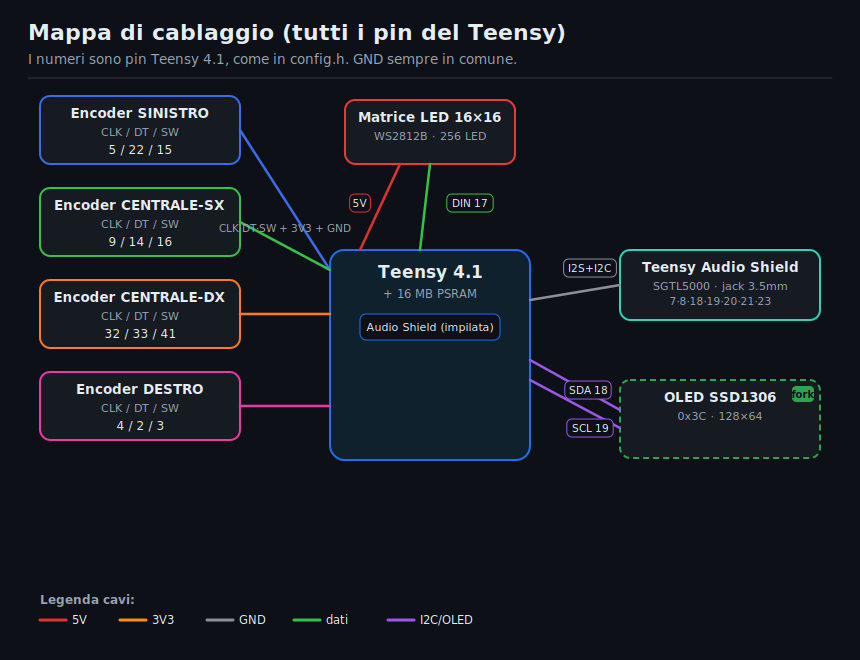
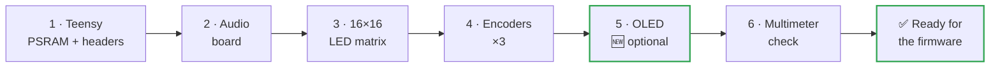
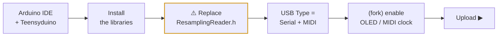
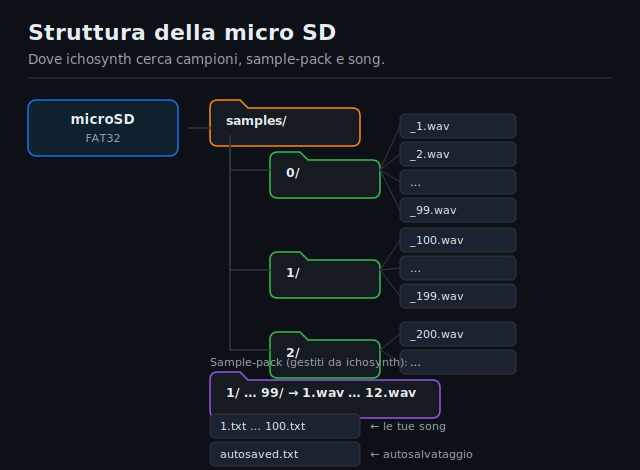

[🇮🇹 Italiano](MANUALE_COSTRUZIONE.md) · **🇬🇧 English**

<div align="center">

# 🔧 ichosynth — Build Manual

### DIY 3-encoder version, hand-wired (no printed PCB)

Step-by-step guide for beginners: build your own **ichosynth** using nothing but flying wires (jumpers), following the pin tables.

[-orange.svg)](#2--difficulty-level--read-before-you-buy)
[](#)
[](#)
[](USAGE_MANUAL.md)

</div>

> 🧠 **ichosynth** is a fork of **NI404** (by SP_ / soundpauli): an open-source sampler-sequencer
> based on the **Teensy 4.1**. It generates all its sounds on its own; the computer is needed **only**
> to program it the first time.

> 🆕 **This is the 3-encoder build.** You fit **3 knobs** (LEFT, CENTER, RIGHT): simpler
> and cheaper than the original 4-encoder version. The fork's firmware is already set up for 3 encoders
> (`HAS_ENCODER4 0`): volume on the LEFT, BPM on the CENTER, and the 4th encoder's commands remapped
> onto the 3 push-buttons. Other fork additions: a status **OLED** and **MIDI clock OUT** (both optional).

---

## 📑 Table of Contents

- [1 · What you are building](#1--what-you-are-building)
- [2 · Difficulty level](#2--difficulty-level--read-before-you-buy)
- [3 · Bill of materials (BOM)](#3--bill-of-materials-bom)
- [4 · Tools you'll need](#4--tools-youll-need)
- [5 · Safety](#5--basic-safety-concepts)
- [6 · Complete pin map](#6--complete-pin-map-the-firmwares-truth)
- [7 · Step-by-step assembly](#7--step-by-step-assembly)
- [8 · Software: flashing the firmware](#8--software-flashing-the-firmware)
- [9 · Preparing the micro SD](#9--preparing-the-micro-sd-samples)
- [10 · First boot and testing](#10--first-boot-and-testing)
- [11 · Troubleshooting](#11--troubleshooting)
- [12 · Pin cheat-sheet](#12--pin-summary-cheat-sheet)

---

## 1 · What you are building

- A brain: the **Teensy 4.1** (a powerful microcontroller).
- An audio board (**Teensy Audio Adaptor**) with a 3.5 mm headphone output.
- A playing display: a **16×16 RGB LED matrix** (256 LEDs).
- **Three rotary knobs with push-buttons** (KY-040 encoders): LEFT, CENTER, RIGHT.
- A **micro SD** card that holds the audio samples and your patterns.
- 🆕 *(optional, added by this fork)* a small **OLED screen** showing mode, BPM, volume, etc.

Everything is powered from the **USB (5V)** port.

---

## 2 · Difficulty level — read before you buy

> ⚠️ **Honesty first.** The wiring is easy; the hard part is just **one thing**: soldering the
> two SMD PSRAM chips onto the back of the Teensy.

| Part | Difficulty | Notes |
|---|---|---|
| Matrix + encoder wiring | 🟢 Easy | chunky solder joints and wire connections, suitable for patient beginners |
| **PSRAM** soldering (2× SMD chips) | 🔴 Hard | tiny components; see options below |

- **PSRAM — option A (recommended):** buy the Teensy 4.1 **with the PSRAM already soldered**, or have it soldered by someone with experience / a hot-air station.
- **PSRAM — option B:** practice first on practice boards.
- ⚠️ The PSRAM **is mandatory**: the firmware uses ~16 MB of external memory (you need **two** 8 MB chips). Without it, it won't start.

> ⏱️ Estimated time: half a day for someone who already knows how to solder; longer if it's your first time.

---

## 3 · Bill of materials (BOM)

| Qty | Component | Notes |
|------|------------|------|
| 1 | Teensy 4.1 | the main microcontroller |
| 2 | 8 MB PSRAM chip (APS6404, Teensy 4.1 compatible) | 16 MB total, **mandatory** |
| 1 | Teensy Audio Adaptor Board, **Rev D (for Teensy 4.x)** | SGTL5000 codec + 3.5 mm jack + SD slot (not used) |
| 1 | **WS2812B 16×16** LED matrix (256 LEDs) | rigid or flexible |
| **3** | **KY-040** rotary encoder with push-button | LEFT, CENTER, RIGHT (3-encoder build) |
| 1 | 🆕 *(fork)* Momentary pushbutton (tactile/push) | lowpass filter — between pin 41 and GND (see 6.5) |
| 1 | Micro SD Card, **Class 10**, ≤ 32 GB | formatted **FAT32** |
| 1 | Micro-USB cable + 5V power supply (≥ 2A recommended) | power and programming |
| 1 | Headphones with 3.5 mm jack | ichosynth has no speakers |
| as needed | Dupont jumper wires (~10 cm), pin header strips | for the connections |
| 1 | 🆕 *(optional, fork)* **SSD1306 0.96" 128×64 I2C** OLED | info screen |
| 1 | *(optional)* 3D-printed enclosure | STL files in `_DOCS/_ENCLOSURE/` |

> ℹ️ **Sample licenses**: the project does **not** include audio files. You'll use your own samples (see [ch. 9](#9--preparing-the-micro-sd-samples)).

---

## 4 · Tools you'll need

- 🔥 Fine-tip soldering iron + solder (and flux, very helpful for the PSRAM).
- ✂️ Side cutters, wire strippers, tweezers.
- 🤚 A "third hand" or vise to hold the parts steady.
- 📟 Multimeter (continuity and short-circuit checking — **essential**).
- 🧴 Isopropyl alcohol to clean up flux residue.
- ⚡ Anti-static precautions (ESD wrist strap): the Teensy and PSRAM are sensitive.
- *(only if you solder the PSRAM yourself)* a hot-air station or a precision soldering iron.

---

## 5 · Basic safety concepts

> ⚠️ Four rules that save your components (and your nerves):

1. **Never** connect/disconnect wires while the device is powered.
2. Double-check **GND and 5V/3.3V** before applying power: swapping them can fry your components.
3. After every batch of solder joints, use the multimeter in continuity mode to verify there are **no** shorts between 5V and GND.
4. Work calmly: a "cold" solder joint (dull, blobby) is the #1 cause of malfunctions.

---

## 6 · Complete pin map (the firmware's "truth")

These pins are defined in [`config.h`](config.h) and they are what the software expects.
**Wire exactly these numbers** (all of them are Teensy pins).

<p align="center">
  
</p>

### 6.1 LED matrix
| Matrix signal | Teensy pin |
|-----------------|-----------|
| DIN (data) | **17** |
| +5V | **5V** |
| GND | **GND** |

### 6.2 Audio board (Teensy Audio Adaptor, Rev D)
> 💡 The simplest and most reliable way is to **stack** the audio board on top of the Teensy using pin headers:
> that way these connections make themselves.

If instead you wire it by hand, connect:

| Audio signal | Teensy pin | | Audio signal | Teensy pin |
|---|---|---|---|---|
| MCLK | **23** | | SDA (I2C) | **18** |
| BCLK | **21** | | SCL (I2C) | **19** |
| LRCLK (WS) | **20** | | 3.3V | **3.3V** |
| TX (DIN to codec) | **7** | | GND | **GND** |
| RX (DOUT from codec) | **8** | | | |

> ℹ️ The SD is used from the **Teensy 4.1's built-in slot**, not the one on the audio board.

### 6.3 Encoders (CLK, DT, SW = push-button)
You fit **3 encoders**. Each encoder has 3 signals (CLK, DT, SW) + power. Arrange them from left to
right as shown in the table.

| Encoder (role in the 3-encoder build) | CLK | DT | SW |
|---|---|---|---|
| **LEFT** — cursor up/down, delete, single · *volume* | **5** | **22** | **15** |
| **CENTER** — page, draw note, Play/Pause, back · *BPM* | **9** | **14** | **16** |
| **RIGHT** — cursor left/right, mute, velocity | **4** | **2** | **3** |

In addition, for each encoder: the **"+"** pin goes to **3.3V**, the **GND** pin goes to **GND**.

> 🆕 **The 4th encoder is not fitted.** In the firmware it's already set to `#define HAS_ENCODER4 0`; the
> 4th encoder's rotation pins (CLK 32 / DT 33) are `99` = unused. The commands the original placed on the
> 4th encoder are remapped onto the 3 push-buttons (see Usage Manual, ch. 16). **Seek** stays disabled;
> the **lowpass filter** is instead available through a small pushbutton (see 6.5).

### 6.4 Optional OLED (fork)
It shares the **same I2C bus as the audio** (no extra pins: same SDA/SCL).

| OLED signal | Teensy pin |
|--------------|-----------|
| SDA | **18** |
| SCL | **19** |
| VCC | **3.3V** |
| GND | **GND** |

> ℹ️ Default I2C address **0x3C** (some panels use 0x3D).

### 6.5 FILTER button (fork) 🆕
A **plain momentary pushbutton** (tactile/push type) that enables the **per-voice lowpass filter** (see
Usage Manual, ch. 15). Not an encoder: just two wires.

| Button signal | Teensy pin |
|---------------|-----------|
| one leg | **41** |
| other leg | **GND** |

> ℹ️ It uses the Teensy's **internal pull-up** (active-low pin): no external resistor. Pin **41** is
> exactly where the original's 4th-encoder button would sit. Don't want the filter? Set
> `#define FILTER_ENABLED 0` in `config.h` and omit the button.

---

## 7 · Step-by-step assembly



### Step 1 — Prepare the Teensy 4.1
1. Solder the **two PSRAM chips** onto the pads on the back (see [ch. 2](#2--difficulty-level--read-before-you-buy): if you don't feel up to it, get a Teensy with the PSRAM already fitted).
2. Solder the **headers** onto the edges of the Teensy (and those for the audio board if you stack it).
3. Connect it to the PC via USB and check that it's recognized (full test in Step 7 / ch. 10).

### Step 2 — Audio board
1. Stack the audio board on the Teensy (recommended) **or** wire the signals from [table 6.2](#62-audio-board-teensy-audio-adaptor-rev-d).
2. Plug the headphones into the 3.5 mm jack (for testing).

### Step 3 — 16×16 LED matrix
1. Find the **data input arrow** (input): it goes to pin **17**. The output stays free.
2. Connect the matrix's **5V** and **GND**.
3. ⚡ **Power**: the firmware uses low-brightness colors, so USB is usually enough. If you raise the brightness in the future, inject the 5V from a dedicated power supply and **join the grounds (common GND)** between the Teensy and the matrix.

### Step 4 — Encoders (×3)
1. For each of the **3 encoders**, connect CLK, DT, SW per [table 6.3](#63-encoders-clk-dt-sw--push-button), plus "+" (3.3V) and GND.
2. Arrange them from left to right: **LEFT → CENTER → RIGHT**.
3. Keep the wires tidy and label them: crossing CLK/DT is the most common mistake (it can also be fixed in software, see troubleshooting).
4. The **4th encoder's** rotation pins (32/33) stay **free**: nothing is fitted there. *(Pin 41 hosts the optional FILTER button — see 6.5.)*

### Step 5 — OLED (optional) 🆕
1. Connect the 4 wires from [table 6.4](#64-optional-oled-fork). Since it's on the same bus as the audio, you just connect it in parallel to SDA/SCL.

### Step 6 — Final check before powering on
1. With the multimeter, verify there's **no short** between 5V and GND and between 3.3V and GND.
2. Double-check that 5V/3.3V/GND are on the correct pins.

---

## 8 · Software: flashing the firmware



### 8.1 Setting up the environment
1. Install **Arduino IDE**.
2. Install **Teensyduino** (the PJRC add-on that adds Teensy support).

### 8.2 Required libraries
- WS2812Serial
- FastLED (≥ 3.9.x)
- Encoder (Paul Stoffregen) — included in Teensyduino
- Audio (Teensy Audio Library) — included in Teensyduino
- Mapf
- TeensyPolyphony (newdigate)
- teensy-variable-playback (newdigate)
- avdweb_Switch
- 🆕 **only if you use the fork's OLED:** Adafruit_SSD1306 and Adafruit_GFX

### 8.3 MANDATORY step: ResamplingReader.h
> ⚠️ Inside newdigate's `teensy-variable-playback` library, **replace** the file
> `ResamplingReader.h` with the one provided here: [`_DOCS/ResamplingReader.h`](_DOCS/ResamplingReader.h).
> It helps avoid null-pointer (nullptr) errors.

### 8.4 Compilation settings
In Arduino IDE's **Tools** menu:
- **Board:** Teensy 4.1
- **USB Type:** **Serial + MIDI** *(required: MIDI goes through the USB port)*
- **CPU Speed:** default (600 MHz)

### 8.5 (Fork) config.h: 3 encoders, OLED and MIDI clock out
In [`config.h`](config.h) the 3-encoder build is **already set**:
```c
#define HAS_ENCODER4 0            // 3-encoder build (this is ours)
```
If you want, you can also enable the fork's optional features by setting them to `1`:
```c
#define OLED_ENABLED 1            // enable the OLED screen
#define MIDI_CLOCK_OUT_ENABLED 1  // send MIDI clock to external instruments
```
> 🆕 `OLED_ENABLED` and `MIDI_CLOCK_OUT_ENABLED` at `0` (default) = no extra features. `HAS_ENCODER4
> 0` is our 3-knob build; leave it as is.

### 8.6 Compile and upload
1. Open `soundpauli_ni404.ino`.
2. Press **Upload** (the Teensy enters programming mode on its own; if needed, press the little button on the Teensy).

---

## 9 · Preparing the micro SD (samples)

The firmware looks for samples on the SD using this **precise structure**:

<p align="center">
  /_<number>.wav, sample-pack 1..99, song .txt and autosaved.txt" width="620">
</p>

```
/samples/<folder>/_<number>.wav      where  <number> = folder*100 + index
```

Real examples (see the project's `_SDCARD/` folder):

```
/samples/0/_1.wav      (folder 0, sample 1)
/samples/0/_99.wav
/samples/1/_100.wav    (folder 1, sample 0)
/samples/2/_200.wav    (folder 2, sample 0)
```

**Rules:**
- On the **root** of the SD, create a `samples` folder, and inside it the numbered folders `0`, `1`, `2`, … (up to 9).
- The files must be named `_<number>.wav` with the numbering shown above.
- ⚠️ **Required audio format: WAV mono, 16 bit, 44100 Hz.**

### Converting your samples
In the `_SDCARD/` folder you'll find the tools that convert any WAV into the right format and
rename it `_N.wav`.

**🪟 `wavmaker.exe` — graphical interface (Windows, no Python required), recommended**

Double-click: a window opens. Then:
1. **Add files** (or **Add folder**) with your WAVs — the list shows the **current format**
   of each one and the **destination name** (`_1.wav`, `_2.wav`, …). **Green** rows are already in
   the right format.
2. Set the **Starting number** (e.g. `1` for `samples/0`, `100` for `samples/1`, …): the window
   reminds you which SD folder they'll end up in.
3. Choose the **Destination folder** (by default a new `wav_convertiti` folder: the
   **originals are NOT touched**).
4. Press **Convert**. Progress bar + log, then move the `_N.wav` files into `samples/<n>/` on the SD.

> ✅ The GUI is **non-destructive**: it writes the converted files into a separate folder. Only if you tick
> *"Delete originals"* (with confirmation) does it delete the source files.

**🐍 Python versions** (Windows/macOS/Linux, Python required): `python wavmaker_gui.py` (same GUI) or
`python wavmaker.py` (command-line version). On Python 3.13+ you need `pip install audioop-lts`.

> 📁 **Sample packs** (see Usage Manual): numbered folders `1`..`99` on the root, each containing
> `1.wav`..`12.wav`. ichosynth creates/uses them directly from the menu — you don't need to prepare them by hand.

---

## 10 · First boot and testing

1. Insert the SD, plug in the headphones, power it via USB.
2. On power-up you'll see an **animation/logo** on the matrix.
3. If the SD is missing, the **"noSD"** icon (red) appears: power off, insert the SD, power back on.
4. Move the **LEFT** and **RIGHT** encoders: a pulsing white dot (the cursor) should move.
5. Press (push) the **CENTER** encoder to place a note: you should hear the sample.
6. **Double-click** the **CENTER** encoder: Play/Pause.

> 🎮 To learn how to play it, head to the **[Usage Manual](USAGE_MANUAL.md)**.

---

## 11 · Troubleshooting

| Symptom | Likely cause / fix |
|--------|----------------------------|
| 🔌 Won't power on / not recognized by the PC | Charge-only USB cable (use a data one); header solder joints; 5V-GND short |
| 🔁 Reboots on its own / crashes after a few seconds | PSRAM missing or badly soldered; weak USB power (use 5V ≥ 2A) |
| 💡 LEDs don't light up / wrong colors | DIN not on pin 17; data arrow reversed (use the input); GND not common |
| 🌫️ Only some LEDs light up randomly | Insufficient power to the matrix; missing common GND |
| ↩️ An encoder turns "backwards" | Swap the **CLK and DT** wires on that encoder |
| 🔇 An encoder does nothing | Button/signals on the wrong pins; recheck [table 6.3](#63-encoders-clk-dt-sw--push-button) |
| ▶️ I can't trigger Play | in the 3-encoder build it's a **double-click** on the CENTER (see Usage Manual, ch. 16) |
| 🎛️ The filter doesn't change the sound | check the button between pin **41** and **GND**; the filter acts on the **voice under the cursor** (6.5) |
| 🎧 No sound in the headphones | Audio board not connected properly (7,8,20,21,23,18,19); `USB Type` not set; volume at 0 |
| ❌ Compilation: nullptr / ResamplingReader errors | You didn't replace `ResamplingReader.h` (see [8.3](#83-mandatory-step-resamplingreaderh)) |
| 🚫 Samples won't play / channel muted | Wrong SD structure/path; WAV not mono-16bit-44.1k (use `wavmaker.py`) |
| 📟 OLED black | `OLED_ENABLED` not set to 1; address 0x3D instead of 0x3C; SDA/SCL swapped |

---

## 12 · Pin summary (cheat-sheet)

```
LED matrix DIN ............ 17        Audio MCLK ... 23   Audio SDA ... 18
                                      Audio BCLK ... 21   Audio SCL ... 19
Encoder LEFT      CLK 5  DT 22 SW 15  Audio LRCLK .. 20
Encoder CENTER    CLK 9  DT 14 SW 16  Audio TX ..... 7
Encoder RIGHT     CLK 4  DT 2  SW 3   Audio RX ..... 8
                                      OLED ......... SDA 18 / SCL 19 (0x3C)
4th encoder ...... NOT fitted (pins 32/33 free)
FILTER button .... pin 41  ->  GND   (fork, per-voice lowpass)
```

> ⚡ Power rails: matrix = **5V**; encoders, OLED and audio = **3.3V**; **GND always common** across everything.

---

<div align="center">

Happy building! 🛠️ Once it makes sound, move on to the **[Usage Manual](USAGE_MANUAL.md)**.

*ichosynth is a fork of **NI404** by SP_ (soundpauli) · open-source MIT firmware.*

</div>
