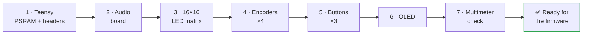
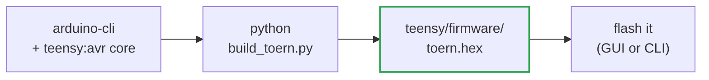

[🇮🇹 Italiano](MANUALE_COSTRUZIONE.md) · **🇬🇧 English**

<div align="center">

# 🔧 ichosynth — Build Manual

### DIY hand-wired build (no printed PCB)

Step-by-step guide for beginners: build your own **ichosynth** using nothing but flying wires (jumpers), following the pin tables.

[-orange.svg)](#2--difficulty-level--read-before-you-buy)
[](#)
[](https://toern.live)
[](USAGE_MANUAL.md)

</div>

> 🧠 **ichosynth** is a hand-soldered, low-cost build of **TŒRN** (by SP_ / soundpauli, https://toern.live):
> an open-source sampler-sequencer based on the **Teensy 4.1**. It runs the **real TŒRN firmware** —
> ported to cheap, solderable input parts — and generates all its sounds on its own; the computer is
> needed **only** to program it the first time.

> 🆕 **What changes vs. TŒRN.** TŒRN's expensive parts (I²C RGB encoders, capacitive touch pads) are
> swapped for **4 cheap KY-040 rotary encoders** (turn + push) and **3 tact switches**. TŒRN's per-encoder
> RGB ring feedback is replaced by a small **SSD1306 OLED** that shows channel, mode, transport, BPM,
> volume and page. Everything else — the DSP, the sequencer, the sampler — is the unchanged TŒRN firmware.

---

## 📑 Table of Contents

- [1 · What you are building](#1--what-you-are-building)
- [2 · Difficulty level](#2--difficulty-level--read-before-you-buy)
- [3 · Bill of materials (BOM)](#3--bill-of-materials-bom)
- [4 · Tools you'll need](#4--tools-youll-need)
- [5 · Safety](#5--basic-safety-concepts)
- [6 · Complete pin map](#6--complete-pin-map-the-firmwares-truth)
- [7 · Step-by-step assembly](#7--step-by-step-assembly)
- [8 · Software: flashing the firmware](#8--software-flashing-the-firmware)
- [9 · Preparing the micro SD](#9--preparing-the-micro-sd-samples)
- [10 · First boot and testing](#10--first-boot-and-testing)
- [11 · Troubleshooting](#11--troubleshooting)
- [12 · Pin cheat-sheet](#12--pin-summary-cheat-sheet)

---

## 1 · What you are building

- A brain: the **Teensy 4.1** (a powerful microcontroller).
- An audio board (**Teensy Audio Adaptor**, SGTL5000) with a 3.5 mm headphone output.
- A playing display: a **16×16 RGB LED matrix** (256 LEDs, chainable to 32×16).
- **Four rotary knobs with push-buttons** (KY-040 encoders): E1 (left) → E4 (right).
- **Three tact switches**: PLAY, MENU, REC.
- A small **OLED screen** (SSD1306 128×64) showing channel, mode, transport, BPM, volume, page.
- A **micro SD** card that holds the audio samples and your patterns.

Everything is powered from the **USB (5V)** port.

---

## 2 · Difficulty level — read before you buy

> ⚠️ **Honesty first.** The wiring is easy; the hard part is just **one thing**: soldering the
> two SMD PSRAM chips onto the back of the Teensy.

| Part | Difficulty | Notes |
|---|---|---|
| Matrix + encoder + button wiring | 🟢 Easy | chunky solder joints and wire connections, suitable for patient beginners |
| **PSRAM** soldering (2× SMD chips) | 🔴 Hard | tiny components; see options below |

- **PSRAM — option A (recommended):** buy the Teensy 4.1 **with the PSRAM already soldered**, or have it soldered by someone with experience / a hot-air station.
- **PSRAM — option B:** practice first on practice boards.
- ⚠️ The PSRAM **is mandatory**: TŒRN uses ~16.5 MB of external memory, so you need **both** 8 MB chips soldered (16 MB total). Without them the firmware will not run.

> ⏱️ Estimated time: half a day for someone who already knows how to solder; longer if it's your first time.

---

## 3 · Bill of materials (BOM)

| Qty | Component | Notes |
|------|------------|------|
| 1 | Teensy 4.1 | the main microcontroller |
| 2 | 8 MB PSRAM chip (APS6404, Teensy 4.1 compatible) | 16 MB total, **mandatory (both chips)** |
| 1 | Teensy Audio Adaptor Board, **Rev D (for Teensy 4.x)** | SGTL5000 codec + 3.5 mm headphone jack (no speaker); its SD slot is not used |
| 1 | **WS2812 RGB 16×16** LED matrix (256 LEDs) | rigid or flexible; chainable to 32×16 |
| **4** | **KY-040** rotary encoder with push-button | E1 (left) → E4 (right) |
| **3** | Tact switch (momentary, tactile/push) | PLAY · MENU · REC (each: one leg to pin, other leg to GND) |
| 1 | Micro SD Card, **Class 10** | for samples and patterns |
| 1 | Micro-USB cable + 5V power supply (≥ 2A recommended) | power and programming |
| 1 | Headphones with 3.5 mm jack | ichosynth has no speakers; on-board jack for monitoring |
| **3** | **6.35 mm (1/4") mono TS jack** | audio I/O: 1× Line In (mono) + 2× Line Out (L + R) → Audio Shield LINE IN / LINE OUT pads |
| as needed | *(optional)* 10 µF electrolytic capacitor | series DC-blocking on the line jacks, only if connected gear hums |
| 1 | **SSD1306 0.96" 128×64 I²C** OLED | status screen (replaces TŒRN's encoder RGB rings) |
| as needed | Dupont jumper wires (~10 cm), pin header strips | for the connections |
| 1 | *(optional)* 3D-printed enclosure | STL files in `_DOCS/_ENCLOSURE/` |

> ℹ️ **Sample licenses**: the project does **not** include audio files. You'll use your own samples (see [ch. 9](#9--preparing-the-micro-sd-samples)).

---

## 4 · Tools you'll need

- 🔥 Fine-tip soldering iron + solder (and flux, very helpful for the PSRAM).
- ✂️ Side cutters, wire strippers, tweezers.
- 🤚 A "third hand" or vise to hold the parts steady.
- 📟 Multimeter (continuity and short-circuit checking — **essential**).
- 🧴 Isopropyl alcohol to clean up flux residue.
- ⚡ Anti-static precautions (ESD wrist strap): the Teensy and PSRAM are sensitive.
- *(only if you solder the PSRAM yourself)* a hot-air station or a precision soldering iron.

---

## 5 · Basic safety concepts

> ⚠️ Four rules that save your components (and your nerves):

1. **Never** connect/disconnect wires while the device is powered.
2. Double-check **GND and 5V/3.3V** before applying power: swapping them can fry your components.
3. After every batch of solder joints, use the multimeter in continuity mode to verify there are **no** shorts between 5V and GND.
4. Work calmly: a "cold" solder joint (dull, blobby) is the #1 cause of malfunctions.

---

## 6 · Complete pin map (the firmware's "truth")

These pins are what the firmware expects. They live in the build sources — the encoder/button tables
`ICHOS_ENC_PINS` and `ICHOS_BTN_PINS` under `teensy/libraries/`, plus `teensy/build_toern.py` — **not**
in a `config.h`. **Wire exactly these numbers** (all of them are Teensy pins).

> 🧭 These pins were chosen deliberately to avoid TŒRN's hard-coded GPIO and the Teensy Audio Shield's
> reserved pins. **Do not use pins 2 / 3 / 4** (TŒRN internal use) or **pin 24** (was an optional LED
> strip, removed in this build).

<p align="center">
  
</p>

### 6.1 LED matrix
| Matrix signal | Teensy pin |
|-----------------|-----------|
| DIN (data) | **17** |
| +5V | **5V** |
| GND | **GND** |

### 6.2 Audio board (Teensy Audio Adaptor, Rev D)
> 💡 The simplest and most reliable way is to **stack** the audio board on top of the Teensy using pin headers:
> that way these connections make themselves.

If instead you wire it by hand, connect:

| Audio signal | Teensy pin | | Audio signal | Teensy pin |
|---|---|---|---|---|
| MCLK | **23** | | SDA (I²C) | **18** |
| BCLK | **21** | | SCL (I²C) | **19** |
| LRCLK (WS) | **20** | | 3.3V | **3.3V** |
| TX (DIN to codec) | **7** | | GND | **GND** |
| RX (DOUT from codec) | **8** | | | |

> ℹ️ The SD is used from the **Teensy 4.1's built-in slot**, not the one on the audio board.

### 6.2.1 Audio I/O jacks (Line In + Line Out)
Beyond the on-board 3.5 mm headphone jack, you add three **6.35 mm (1/4") mono TS jacks** for connecting
to outside gear: **1× Line In** (mono) and **2× Line Out** (stereo: L + R). These wire to the **solder
pads on the Teensy Audio Adaptor** (the LINE IN / LINE OUT pads on the codec board) — **not** to Teensy
GPIO pins.

<p align="center">
  
</p>

Every 6.35 mm jack is **TS mono**: **tip = signal**, **sleeve = GND** (common ground with the rest of
the build).

| 6.35 mm jack | Tip (signal) → Audio Shield pad | Sleeve |
|---|---|---|
| **Line In** (mono) | **LINE IN L** | **GND** |
| **Line Out L** | **LINE OUT L** | **GND** |
| **Line Out R** | **LINE OUT R** | **GND** |
| Headphone | *(none — existing on-board 3.5 mm jack)* | — |

- **Line In is mono.** TŒRN records/monitors the **LEFT** line-in channel as a mono sample, and LINE IN
  is already the firmware's default recording input — so **no firmware change is needed**.
- **Line Out is stereo** (two jacks, L + R). The SGTL5000 DAC drives Line Out and the headphone output
  together; since TŒRN has true stereo panning, the two jacks preserve the stereo image.
- *(Optional)* If a connected device hums, add a **10 µF series DC-blocking electrolytic cap** in line
  with each signal. Direct wiring is normally fine, so this is optional.

> 🎚️ **What they're for:** **Line In** = sample external instruments / a field recorder / other gear
> straight into the sampler. **Line Out (L+R)** = feed an amp / mixer / PA / audio interface. **Headphone**
> (on-board 3.5 mm) = monitoring.

### 6.3 Encoders (CLK, DT, SW = push-button)
You fit **4 encoders**. Each encoder has 3 signals (CLK, DT, SW) + power. Arrange them from left to
right (E1 → E4) as shown in the table.

| Encoder | CLK | DT | SW |
|---|---|---|---|
| **E1 (left)** | **5** | **22** | **15** |
| **E2** | **32** | **33** | **41** |
| **E3** | **9** | **14** | **16** |
| **E4 (right)** | **37** | **38** | **39** |

In addition, for each encoder: the **"+"** pin goes to **3.3V**, the **GND** pin goes to **GND**.

### 6.4 Buttons — 3 tact switches (PLAY / MENU / REC)
Plain momentary pushbuttons (tactile/push type). Each one: **one leg to the Teensy pin, the other leg
to GND**. They use the Teensy's **internal pull-up** (active-low) — no external resistor needed.

| Button | Role | Teensy pin |
|---|---|---|
| **B1** | PLAY | **25** |
| **B2** | MENU | **26** |
| **B3** | REC | **28** |

### 6.5 OLED (SSD1306)
It shares the **same I²C bus as the audio codec** (no extra signal pins: same SDA/SCL). It also needs
its own 3V3 and GND.

| OLED signal | Teensy pin |
|--------------|-----------|
| SDA | **18** |
| SCL | **19** |
| VCC | **3.3V** |
| GND | **GND** |

> ℹ️ Default I²C address **0x3C** (some panels use 0x3D). The OLED replaces TŒRN's encoder RGB-ring
> feedback, showing channel / mode / transport / BPM / volume / page.

---

## 7 · Step-by-step assembly



### Step 1 — Prepare the Teensy 4.1
1. Solder the **two PSRAM chips** onto the pads on the back (see [ch. 2](#2--difficulty-level--read-before-you-buy): if you don't feel up to it, get a Teensy with the PSRAM already fitted). Both chips are mandatory.
2. Solder the **headers** onto the edges of the Teensy (and those for the audio board if you stack it).
3. Connect it to the PC via USB and check that it's recognized (full test in Step 8 / ch. 10).

### Step 2 — Audio board
1. Stack the audio board on the Teensy (recommended) **or** wire the signals from [table 6.2](#62-audio-board-teensy-audio-adaptor-rev-d).
2. Plug the headphones into the 3.5 mm jack (for testing).

### Step 3 — 16×16 LED matrix
1. Find the **data input arrow** (input): it goes to pin **17**. The output stays free (chainable to 32×16 if you add a second panel).
2. Connect the matrix's **5V** and **GND**.
3. ⚡ **Power**: the firmware uses low-brightness colors, so USB is usually enough. If you raise the brightness in the future, inject the 5V from a dedicated power supply and **join the grounds (common GND)** between the Teensy and the matrix.

### Step 4 — Encoders (×4)
1. For each of the **4 encoders**, connect CLK, DT, SW per [table 6.3](#63-encoders-clk-dt-sw--push-button), plus "+" (3.3V) and GND.
2. Arrange them from left to right: **E1 → E2 → E3 → E4**.
3. Keep the wires tidy and label them: crossing CLK/DT is the most common mistake (it can also be fixed in software, see troubleshooting).
4. ⚠️ Don't accidentally use pins **2 / 3 / 4** (TŒRN internal use) or **24** (removed LED strip) — none of the encoders touch them.

### Step 5 — Buttons (×3)
1. Wire each tact switch with **one leg to its Teensy pin** and **the other leg to GND** per [table 6.4](#64-buttons--3-tact-switches-play--menu--rec).
2. No resistors needed: the firmware enables the internal pull-ups (active-low).

### Step 6 — OLED
1. Connect the 4 wires from [table 6.5](#65-oled-ssd1306). Since it's on the same bus as the audio, you just connect it in parallel to SDA/SCL; give it its own 3V3 and GND.

### Step 7 — Final check before powering on
1. With the multimeter, verify there's **no short** between 5V and GND and between 3.3V and GND.
2. Double-check that 5V/3.3V/GND are on the correct pins.

---

## 8 · Software: flashing the firmware

The firmware is the **real TŒRN** ported to our hardware. You don't edit Arduino settings by hand — a
build script handles the whole toolchain (it builds at `-O1`, the option TŒRN's large single translation
unit needs to compile cleanly on the Teensy gcc).



### 8.1 Build from source (recommended)
1. Install **arduino-cli** and add the **teensy:avr** core (≥ 1.61.0).
2. From the repo root, run:
   ```sh
   python teensy/build_toern.py
   ```
   This produces **`teensy/firmware/toern.hex`**. See [`teensy/README.md`](teensy/README.md) for details
   (it also clones the TŒRN sources if missing and applies the pin remap for our 3 buttons).
3. To build **and** flash in one go (needs `teensy_loader_cli`):
   ```sh
   python teensy/build_toern.py --flash
   ```

> 🧱 The build pins the optimization level to **`opt=o1std` (-O1)**. At the default `-O2` the Teensy gcc
> can crash on TŒRN's ~23k-line single file; `-O1` compiles cleanly and still fits with room to spare.

### 8.2 One-click GUI flasher (prebuilt .hex)
If you already have a `toern.hex`, the **`_FLASHER`** folder contains a one-click GUI flasher: pick the
board, pick the `.hex`, press flash. No Arduino IDE required.

> ℹ️ Hardware note: this is a **Teensy 4.1**. The build script sets the USB type for you (Serial + MIDI).
> If the loader doesn't see the board, press the little button on the Teensy to enter programming mode.

---

## 9 · Preparing the micro SD (samples)

The firmware looks for samples on the SD using this **precise structure**:

<p align="center">
  /_<number>.wav, sample-pack 1..99, song .txt and autosaved.txt" width="620">
</p>

```
/samples/<folder>/_<number>.wav      where  <number> = folder*100 + index
```

Real examples (see the project's `_SDCARD/` folder):

```
/samples/0/_1.wav      (folder 0, sample 1)
/samples/0/_99.wav
/samples/1/_100.wav    (folder 1, sample 0)
/samples/2/_200.wav    (folder 2, sample 0)
```

**Rules:**
- On the **root** of the SD, create a `samples` folder, and inside it the numbered folders `0`, `1`, `2`, … (up to 9).
- The files must be named `_<number>.wav` with the numbering shown above.
- ⚠️ **Required audio format: WAV mono, 16 bit, 44100 Hz.**

### Converting your samples
In the `_SDCARD/` folder you'll find the tools that convert any WAV into the right format and
rename it `_N.wav`.

**🪟 `wavmaker.exe` — graphical interface (Windows, no Python required), recommended**

Double-click: a window opens. Then:
1. **Add files** (or **Add folder**) with your WAVs — the list shows the **current format**
   of each one and the **destination name** (`_1.wav`, `_2.wav`, …). **Green** rows are already in
   the right format.
2. Set the **Starting number** (e.g. `1` for `samples/0`, `100` for `samples/1`, …): the window
   reminds you which SD folder they'll end up in.
3. Choose the **Destination folder** (by default a new `wav_convertiti` folder: the
   **originals are NOT touched**).
4. Press **Convert**. Progress bar + log, then move the `_N.wav` files into `samples/<n>/` on the SD.

> ✅ The GUI is **non-destructive**: it writes the converted files into a separate folder. Only if you tick
> *"Delete originals"* (with confirmation) does it delete the source files.

**🐍 Python versions** (Windows/macOS/Linux, Python required): `python wavmaker_gui.py` (same GUI) or
`python wavmaker.py` (command-line version). On Python 3.13+ you need `pip install audioop-lts`.

> 📁 **Sample packs** (see Usage Manual): numbered folders `1`..`99` on the root, each containing
> `1.wav`..`12.wav`. ichosynth creates/uses them directly from the menu — you don't need to prepare them by hand.

---

## 10 · First boot and testing

1. Insert the SD, plug in the headphones, power it via USB.
2. On power-up you'll see an **animation/logo** on the matrix, and the **OLED** lights up with the status (channel, mode, BPM, volume, page).
3. If the SD is missing, the **"noSD"** icon (red) appears: power off, insert the SD, power back on.
4. Move the encoders: the matrix and the OLED should react (cursor, volume, BPM, …).
5. Press an encoder / a button to place a note or trigger transport: you should hear the sample.
6. Try the **PLAY** button to start/stop the sequencer.

> 🎮 To learn how to play it, head to the **[Usage Manual](USAGE_MANUAL.md)** and the control map in
> [`_DOCS/MAPPA_CONTROLLI.md`](_DOCS/MAPPA_CONTROLLI.md).

---

## 11 · Troubleshooting

| Symptom | Likely cause / fix |
|--------|----------------------------|
| 🔌 Won't power on / not recognized by the PC | Charge-only USB cable (use a data one); header solder joints; 5V-GND short |
| 🔁 Reboots on its own / crashes after a few seconds | PSRAM missing or badly soldered (both chips required); weak USB power (use 5V ≥ 2A) |
| 💡 LEDs don't light up / wrong colors | DIN not on pin 17; data arrow reversed (use the input); GND not common |
| 🌫️ Only some LEDs light up randomly | Insufficient power to the matrix; missing common GND |
| ↩️ An encoder turns "backwards" | Swap the **CLK and DT** wires on that encoder |
| 🔇 An encoder does nothing | Signals on the wrong pins; recheck [table 6.3](#63-encoders-clk-dt-sw--push-button); make sure you didn't land on 2/3/4 |
| 🔘 A button does nothing | One leg must go to the pin, the other to **GND**; recheck [table 6.4](#64-buttons--3-tact-switches-play--menu--rec) (25/26/28) |
| 🎧 No sound in the headphones | Audio board not connected properly (7,8,20,21,23,18,19); volume at 0 |
| ❌ Build fails / compiler error | Make sure `arduino-cli` and the `teensy:avr` core are installed; run `python teensy/build_toern.py` (it builds at -O1 — see [`teensy/README.md`](teensy/README.md)) |
| 🚫 Samples won't play / channel muted | Wrong SD structure/path; WAV not mono-16bit-44.1k (use `wavmaker.py`) |
| 📟 OLED black | Address 0x3D instead of 0x3C; SDA/SCL swapped; missing 3V3/GND |

---

## 12 · Pin summary (cheat-sheet)

```
LED matrix DIN ............ 17        Audio MCLK ... 23   Audio SDA ... 18
                                      Audio BCLK ... 21   Audio SCL ... 19
Encoder E1 (left)  CLK 5  DT 22 SW 15 Audio LRCLK .. 20
Encoder E2         CLK 32 DT 33 SW 41 Audio TX ..... 7
Encoder E3         CLK 9  DT 14 SW 16 Audio RX ..... 8
Encoder E4 (right) CLK 37 DT 38 SW 39 OLED ......... SDA 18 / SCL 19 (0x3C)
Buttons  PLAY 25   MENU 26   REC 28   (each: pin -> GND, active-low)
Avoid:   pins 2/3/4 (TŒRN internal) and 24 (removed LED strip)
```

> ⚡ Power rails: matrix = **5V**; encoders, OLED and audio = **3.3V**; **GND always common** across everything.

---

<div align="center">

Happy building! 🛠️ Once it makes sound, move on to the **[Usage Manual](USAGE_MANUAL.md)**.

*ichosynth is a hand-soldered, low-cost build of **TŒRN** by SP_ (soundpauli, https://toern.live) · open-source firmware running on a Teensy 4.1.*

</div>
