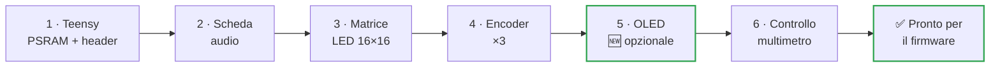
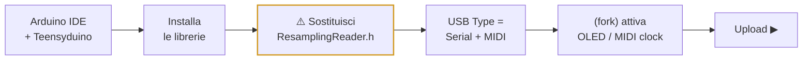

<div align="center">

# 🔧 ichosynth — Manuale di Costruzione

### Versione DIY a 3 encoder, cablata a mano (senza PCB stampato)

Guida passo-passo per principianti: costruisci il tuo **ichosynth** con soli fili volanti (jumper), seguendo le tabelle dei pin.

[-orange.svg)](#2--livello-di-difficoltà--leggi-prima-di-comprare)
[](#)
[](#)
[](MANUALE_USO.md)

</div>

> 🧠 **ichosynth** è il fork di **NI404** (di SP_ / soundpauli): un campionatore-sequencer open-source
> basato su **Teensy 4.1**. Genera tutti i suoni da solo, il computer serve **solo** per programmarlo
> la prima volta.

> 🆕 **Questa è la build a 3 encoder.** Monti **3 manopole** (SINISTRA, CENTRALE, DESTRA): più semplice
> ed economica dell'originale a 4. Il firmware del fork è già impostato per 3 encoder
> (`HAS_ENCODER4 0`): volume sulla SINISTRA, BPM sulla CENTRALE, e i comandi del 4° encoder rimappati
> sui 3 pulsanti. Altre aggiunte del fork: **OLED** di stato e **MIDI clock OUT** (entrambi opzionali).

---

## 📑 Indice

- [1 · Cosa stai costruendo](#1--cosa-stai-costruendo)
- [2 · Livello di difficoltà](#2--livello-di-difficoltà--leggi-prima-di-comprare)
- [3 · Lista componenti (BOM)](#3--lista-componenti-bom)
- [4 · Strumenti necessari](#4--strumenti-necessari)
- [5 · Sicurezza](#5--concetti-base-di-sicurezza)
- [6 · Mappa pin completa](#6--mappa-pin-completa-la-verità-del-firmware)
- [7 · Montaggio passo-passo](#7--montaggio-passo-passo)
- [8 · Software: caricare il firmware](#8--software-caricare-il-firmware)
- [9 · Preparare la micro SD](#9--preparare-la-micro-sd-campioni)
- [10 · Primo avvio e test](#10--primo-avvio-e-test)
- [11 · Risoluzione problemi](#11--risoluzione-problemi)
- [12 · Cheat-sheet pin](#12--schema-riepilogo-pin-cheat-sheet)

---

## 1 · Cosa stai costruendo

- Un cervello: **Teensy 4.1** (un microcontrollore potente).
- Una scheda audio (**Teensy Audio Adaptor**) con uscita cuffie da 3,5 mm.
- Un display di gioco: una **matrice LED RGB 16×16** (256 LED).
- **Tre manopole rotative con pulsante** (encoder KY-040): SINISTRA, CENTRALE, DESTRA.
- Una **micro SD** dove stanno i campioni audio e i tuoi pattern.
- 🆕 *(opzionale, aggiunta di questo fork)* un piccolo **schermo OLED** che mostra modalità, BPM, volume, ecc.

Tutto viene alimentato dalla porta **USB (5V)**.

---

## 2 · Livello di difficoltà — leggi prima di comprare

> ⚠️ **Onestà prima di tutto.** Il cablaggio è facile; la parte difficile è **una sola**: saldare i
> due chip PSRAM SMD sul retro del Teensy.

| Parte | Difficoltà | Note |
|---|---|---|
| Cablaggio matrice + encoder | 🟢 Facile | saldature grosse e collegamenti a filo, adatto a principianti pazienti |
| Saldatura **PSRAM** (2× chip SMD) | 🔴 Difficile | componenti minuscoli; vedi opzioni sotto |

- **PSRAM — opzione A (consigliata):** compra il Teensy 4.1 **con la PSRAM già saldata**, o fattela saldare da chi ha esperienza/stazione ad aria calda.
- **PSRAM — opzione B:** esercitati prima su schede di pratica.
- ⚠️ La PSRAM **è obbligatoria**: il firmware usa ~16 MB di memoria esterna (servono **due** chip da 8 MB). Senza, non parte.

> ⏱️ Tempo stimato: mezza giornata per chi sa già saldare; di più se è la prima volta.

---

## 3 · Lista componenti (BOM)

| Q.tà | Componente | Note |
|------|------------|------|
| 1 | Teensy 4.1 | il microcontrollore principale |
| 2 | Chip PSRAM 8 MB (APS6404, compatibile Teensy 4.1) | totale 16 MB, **obbligatori** |
| 1 | Teensy Audio Adaptor Board, **Rev D (per Teensy 4.x)** | codec SGTL5000 + jack 3,5 mm + slot SD (non usato) |
| 1 | Matrice LED **WS2812B 16×16** (256 LED) | rigida o flessibile |
| **3** | Encoder rotativo **KY-040** con pulsante | SINISTRA, CENTRALE, DESTRA (build a 3 encoder) |
| 1 | Micro SD Card, **Class 10**, ≤ 32 GB | formattata **FAT32** |
| 1 | Cavo micro-USB + alimentatore 5V (≥ 2A consigliato) | alimentazione e programmazione |
| 1 | Cuffie con jack 3,5 mm | ichosynth non ha altoparlanti |
| q.b. | Cavetti jumper Dupont (~10 cm), strip di pin header | per i collegamenti |
| 1 | 🆕 *(opzionale, fork)* OLED **SSD1306 0,96" 128×64 I2C** | schermo informazioni |
| 1 | *(opzionale)* Contenitore stampato 3D | file STL in `_DOCS/_ENCLOSURE/` |

> ℹ️ **Licenze campioni**: il progetto **non** include file audio. Userai i tuoi campioni (vedi [cap. 9](#9--preparare-la-micro-sd-campioni)).

---

## 4 · Strumenti necessari

- 🔥 Saldatore a punta fine + stagno (e flussante, molto utile per la PSRAM).
- ✂️ Tronchesino, spelafili, pinzette.
- 🤚 "Terza mano" o morsa per tenere fermi i pezzi.
- 📟 Multimetro (continuità e cortocircuiti — **fondamentale**).
- 🧴 Alcol isopropilico per pulire i residui di flussante.
- ⚡ Precauzioni antistatiche (braccialetto ESD): Teensy e PSRAM sono sensibili.
- *(solo se saldi tu la PSRAM)* stazione ad aria calda o saldatore di precisione.

---

## 5 · Concetti base di sicurezza

> ⚠️ Quattro regole che salvano i componenti (e i nervi):

1. **Mai** collegare/scollegare fili mentre il dispositivo è alimentato.
2. Doppio controllo **GND e 5V/3,3V** prima di dare corrente: invertirli può bruciare i componenti.
3. Dopo ogni fascio di saldature, col multimetro in continuità verifica che **non** ci siano corti tra 5V e GND.
4. Lavora con calma: una saldatura "fredda" (opaca, a pallina) è la causa #1 di malfunzionamenti.

---

## 6 · Mappa pin completa (la "verità" del firmware)

Questi pin sono definiti in [`config.h`](config.h) e sono ciò che il software si aspetta.
**Wira esattamente questi numeri** (tutti pin del Teensy).

<p align="center">
  
</p>

### 6.1 Matrice LED
| Segnale matrice | Pin Teensy |
|-----------------|-----------|
| DIN (dati) | **17** |
| +5V | **5V** |
| GND | **GND** |

### 6.2 Scheda audio (Teensy Audio Adaptor, Rev D)
> 💡 Il modo più semplice e affidabile è **impilare** la scheda audio sopra il Teensy con i pin header:
> così questi collegamenti si fanno da soli.

Se invece la cabli a mano, collega:

| Segnale audio | Pin Teensy | | Segnale audio | Pin Teensy |
|---|---|---|---|---|
| MCLK | **23** | | SDA (I2C) | **18** |
| BCLK | **21** | | SCL (I2C) | **19** |
| LRCLK (WS) | **20** | | 3,3V | **3.3V** |
| TX (DIN al codec) | **7** | | GND | **GND** |
| RX (DOUT dal codec) | **8** | | | |

> ℹ️ La SD si usa dallo **slot integrato del Teensy 4.1**, non da quello della scheda audio.

### 6.3 Encoder (CLK, DT, SW = pulsante)
Monti **3 encoder**. Ogni encoder ha 3 segnali (CLK, DT, SW) + alimentazione. Disponili da sinistra a
destra come in tabella.

| Encoder (ruolo nella build a 3 encoder) | CLK | DT | SW |
|---|---|---|---|
| **SINISTRA** — cursore su/giù, cancella, single · *volume* | **5** | **22** | **15** |
| **CENTRALE** — pagina, disegna nota, Play/Pausa, indietro · *BPM* | **9** | **14** | **16** |
| **DESTRA** — cursore sin/destra, mute, velocity | **4** | **2** | **3** |

Inoltre, per ogni encoder: il pin **"+"** va a **3,3V**, il pin **GND** va a **GND**.

> 🆕 **Il 4° encoder non si monta.** Nel firmware è già impostato `#define HAS_ENCODER4 0` e i suoi pin
> (CLK 32 / DT 33 / SW 41) sono posti a `99` = non usati. I comandi che l'originale metteva sul 4°
> encoder sono rimappati sui 3 pulsanti (vedi manuale d'uso, cap. 15). Filtro e seek sono disattivati.

### 6.4 OLED opzionale (fork)
Condivide lo **stesso bus I2C dell'audio** (nessun pin extra: stesso SDA/SCL).

| Segnale OLED | Pin Teensy |
|--------------|-----------|
| SDA | **18** |
| SCL | **19** |
| VCC | **3,3V** |
| GND | **GND** |

> ℹ️ Indirizzo I2C predefinito **0x3C** (alcuni pannelli usano 0x3D).

---

## 7 · Montaggio passo-passo



### Fase 1 — Preparare il Teensy 4.1
1. Salda i **due chip PSRAM** nelle piazzole sul retro (vedi [cap. 2](#2--livello-di-difficoltà--leggi-prima-di-comprare): se non te la senti, prendi un Teensy con PSRAM già montata).
2. Salda gli **header** sui bordi del Teensy (e quelli per la scheda audio se la impili).
3. Collega via USB al PC e verifica che venga riconosciuto (test completo in Fase 7/cap. 10).

### Fase 2 — Scheda audio
1. Impila la scheda audio sul Teensy (consigliato) **oppure** cabla i segnali della [tabella 6.2](#62-scheda-audio-teensy-audio-adaptor-rev-d).
2. Collega le cuffie al jack 3,5 mm (per i test).

### Fase 3 — Matrice LED 16×16
1. Individua la **freccia di ingresso dati** (input): va al pin **17**. L'uscita (output) resta libera.
2. Collega **5V** e **GND** della matrice.
3. ⚡ **Alimentazione**: il firmware usa colori a bassa luminosità, quindi di solito l'USB basta. Se in futuro alzi la luminosità, inietta i 5V da un alimentatore dedicato e **unisci le masse (GND comune)** tra Teensy e matrice.

### Fase 4 — Encoder (×3)
1. Per ciascuno dei **3 encoder** collega CLK, DT, SW secondo la [tabella 6.3](#63-encoder-clk-dt-sw--pulsante), più "+" (3,3V) e GND.
2. Disponili da sinistra a destra: **SINISTRA → CENTRALE → DESTRA**.
3. Tieni i fili ordinati ed etichettali: incrociare CLK/DT è l'errore più comune (si corregge anche via software, vedi troubleshooting).
4. I pin del **4° encoder** (32/33/41) restano **liberi**: non si monta nulla lì.

### Fase 5 — OLED (opzionale) 🆕
1. Collega i 4 fili della [tabella 6.4](#64-oled-opzionale-fork). Essendo sullo stesso bus dell'audio, basta collegarsi in parallelo a SDA/SCL.

### Fase 6 — Controllo finale prima di accendere
1. Col multimetro verifica **assenza di corto** tra 5V e GND e tra 3,3V e GND.
2. Ricontrolla che 5V/3,3V/GND siano nei pin giusti.

---

## 8 · Software: caricare il firmware



### 8.1 Installazione ambiente
1. Installa **Arduino IDE**.
2. Installa **Teensyduino** (l'add-on PJRC che aggiunge il supporto Teensy).

### 8.2 Librerie richieste
- WS2812Serial
- FastLED (≥ 3.9.x)
- Encoder (Paul Stoffregen) — inclusa in Teensyduino
- Audio (Teensy Audio Library) — inclusa in Teensyduino
- Mapf
- TeensyPolyphony (newdigate)
- teensy-variable-playback (newdigate)
- avdweb_Switch
- 🆕 **solo se usi l'OLED del fork:** Adafruit_SSD1306 e Adafruit_GFX

### 8.3 Passo OBBLIGATORIO: ResamplingReader.h
> ⚠️ Dentro la libreria `teensy-variable-playback` di newdigate, **sostituisci** il file
> `ResamplingReader.h` con quello fornito qui: [`_DOCS/ResamplingReader.h`](_DOCS/ResamplingReader.h).
> Aiuta a evitare errori di puntatore nullo (nullptr).

### 8.4 Impostazioni di compilazione
Nel menu **Tools** di Arduino IDE:
- **Board:** Teensy 4.1
- **USB Type:** **Serial + MIDI** *(necessario: il MIDI passa dalla porta USB)*
- **CPU Speed:** predefinita (600 MHz)

### 8.5 (Fork) config.h: 3 encoder, OLED e MIDI clock out
In [`config.h`](config.h) la build a 3 encoder è **già impostata**:
```c
#define HAS_ENCODER4 0            // build a 3 encoder (questa è la nostra)
```
Se vuoi, attiva anche le funzioni opzionali del fork mettendole a `1`:
```c
#define OLED_ENABLED 1            // attiva lo schermo OLED
#define MIDI_CLOCK_OUT_ENABLED 1  // invia il clock MIDI a strumenti esterni
```
> 🆕 `OLED_ENABLED` e `MIDI_CLOCK_OUT_ENABLED` a `0` (default) = nessuna funzione extra. `HAS_ENCODER4
> 0` è la nostra build a 3 manopole; lascialo così.

### 8.6 Compilare e caricare
1. Apri `soundpauli_ni404.ino`.
2. Premi **Upload** (il Teensy entra in programmazione da solo; in caso premi il pulsantino sul Teensy).

---

## 9 · Preparare la micro SD (campioni)

Il firmware cerca i campioni sulla SD con questa **struttura precisa**:

<p align="center">
  /_<numero>.wav, sample-pack 1..99, song .txt e autosaved.txt" width="620">
</p>

```
/samples/<cartella>/_<numero>.wav      con  <numero> = cartella*100 + indice
```

Esempi reali (vedi cartella `_SDCARD/` del progetto):

```
/samples/0/_1.wav      (cartella 0, campione 1)
/samples/0/_99.wav
/samples/1/_100.wav    (cartella 1, campione 0)
/samples/2/_200.wav    (cartella 2, campione 0)
```

**Regole:**
- Crea sulla **radice** della SD una cartella `samples`, e dentro le cartelle numerate `0`, `1`, `2`, … (fino a 9).
- I file devono chiamarsi `_<numero>.wav` con la numerazione qui sopra.
- ⚠️ **Formato audio richiesto: WAV mono, 16 bit, 44100 Hz.**

### Convertire i tuoi campioni
Nella cartella `_SDCARD/` trovi due strumenti che convertono qualsiasi WAV nel formato giusto e lo
rinominano `_N.wav`:

- 🪟 **`wavmaker.exe`** (Windows, **nessun Python richiesto**): copia l'`.exe` nella cartella con i tuoi
  `.wav`, fai **doppio click**, inserisci il numero di partenza, premi Invio. Fatto.
- 🐍 **`wavmaker.py`** (Windows/macOS/Linux, serve Python): `python wavmaker.py`.

Passi:
1. Metti i tuoi `.wav` in una cartella insieme allo strumento.
2. Avvialo (`.exe` con doppio click, oppure `python wavmaker.py`).
3. Inserisci il **numero di partenza** (es. `1` per la cartella 0, `100` per la cartella 1, …).
4. Sposta i file `_N.wav` ottenuti nella relativa cartella `samples/<n>/`.

> ⚠️ Lo strumento **sostituisce** gli originali nella cartella (li converte sul posto): lavora su una
> **copia** dei tuoi campioni.

> 📁 **Sample pack** (vedi manuale d'uso): cartelle numerate `1`..`99` sulla radice, ognuna con dentro
> `1.wav`..`12.wav`. Le crea/usa direttamente ichosynth dal menu, non devi prepararle a mano.

---

## 10 · Primo avvio e test

1. Inserisci la SD, collega le cuffie, alimenta via USB.
2. All'accensione vedrai una **animazione/logo** sulla matrice.
3. Se manca la SD compare l'icona **"noSD"** (rossa): spegni, inserisci la SD, riaccendi.
4. Muovi l'encoder **SINISTRA** e **DESTRA**: deve muoversi un puntino bianco pulsante (il cursore).
5. Premi (push) l'encoder **CENTRALE** per piazzare una nota: dovresti sentire il campione.
6. **Doppio click** sull'encoder **CENTRALE**: Play/Pausa.

> 🎮 Per imparare a suonarlo, vai al **[Manuale d'Uso](MANUALE_USO.md)**.

---

## 11 · Risoluzione problemi

| Sintomo | Probabile causa / rimedio |
|--------|----------------------------|
| 🔌 Non si accende / non riconosciuto dal PC | Cavo USB solo-carica (usane uno dati); saldature header; corto 5V-GND |
| 🔁 Si riavvia da solo / crash dopo pochi secondi | PSRAM mancante o mal saldata; alimentazione USB debole (usa 5V ≥ 2A) |
| 💡 LED non si accendono / colori sbagliati | DIN non sul pin 17; freccia dati invertita (usa l'ingresso); GND non comune |
| 🌫️ Solo alcuni LED accesi a caso | Alimentazione insufficiente alla matrice; GND comune mancante |
| ↩️ Un encoder gira "al contrario" | Inverti i fili **CLK e DT** di quell'encoder |
| 🔇 Un encoder non fa nulla | Pulsante/segnali sui pin sbagliati; ricontrolla [tabella 6.3](#63-encoder-clk-dt-sw--pulsante) |
| ▶️ Non riesco a fare Play | nella build a 3 encoder è **doppio click** sulla CENTRALE (vedi manuale d'uso, cap. 15) |
| 🎧 Nessun suono in cuffia | Scheda audio non collegata bene (7,8,20,21,23,18,19); `USB Type` non impostato; volume a 0 |
| ❌ Compilazione: errori nullptr / ResamplingReader | Non hai sostituito `ResamplingReader.h` (vedi [8.3](#83-passo-obbligatorio-resamplingreaderh)) |
| 🚫 Campioni non partono / canale muto | Struttura/percorso SD errati; WAV non mono-16bit-44.1k (usa `wavmaker.py`) |
| 📟 OLED nero | `OLED_ENABLED` non a 1; indirizzo 0x3D invece di 0x3C; SDA/SCL invertiti |

---

## 12 · Schema riepilogo pin (cheat-sheet)

```
LED matrix DIN ............ 17        Audio MCLK ... 23   Audio SDA ... 18
                                      Audio BCLK ... 21   Audio SCL ... 19
Encoder SINISTRA  CLK 5  DT 22 SW 15  Audio LRCLK .. 20
Encoder CENTRALE  CLK 9  DT 14 SW 16  Audio TX ..... 7
Encoder DESTRA    CLK 4  DT 2  SW 3   Audio RX ..... 8
                                      OLED ......... SDA 18 / SCL 19 (0x3C)
4° encoder ....... NON montato (pin 32/33/41 liberi)
```

> ⚡ Alimentazioni: matrice = **5V**; encoder, OLED e audio = **3,3V**; **GND sempre in comune** tra tutto.

---

<div align="center">

Buona costruzione! 🛠️ Quando suona, passa al **[Manuale d'Uso](MANUALE_USO.md)**.

*ichosynth è un fork di **NI404** di SP_ (soundpauli) · firmware open-source MIT.*

</div>
