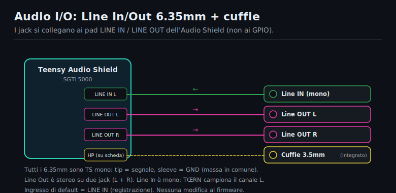
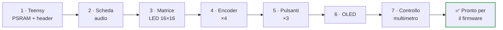
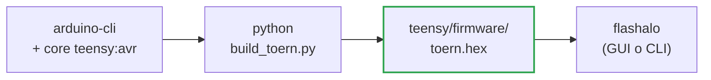

**🇮🇹 Italiano** · [🇬🇧 English](BUILD_MANUAL.md)

<div align="center">

# 🔧 ichosynth — Manuale di Costruzione

### Versione DIY cablata a mano (senza PCB stampato)

Guida passo-passo per principianti: costruisci il tuo **ichosynth** con soli fili volanti (jumper), seguendo le tabelle dei pin.

[-orange.svg)](#2--livello-di-difficoltà--leggi-prima-di-comprare)
[](#)
[](https://toern.live)
[](MANUALE_USO.md)

</div>

> 🧠 **ichosynth** è una build economica, saldata a mano, di **TŒRN** (di SP_ / soundpauli, https://toern.live):
> un campionatore-sequencer open-source basato su **Teensy 4.1**. Esegue il **vero firmware TŒRN** —
> portato su componenti d'ingresso economici e saldabili — e genera tutti i suoni da solo; il computer
> serve **solo** per programmarlo la prima volta.

> 🆕 **Cosa cambia rispetto a TŒRN.** Le parti costose di TŒRN (encoder RGB I²C, pad capacitivi a
> sfioramento) sono sostituite da **4 economici encoder rotativi KY-040** (ruota + premi) e **3 tact
> switch**. Il feedback degli anelli RGB sugli encoder di TŒRN è sostituito da un piccolo **OLED SSD1306**
> che mostra canale, modalità, transport, BPM, volume e pagina. Tutto il resto — DSP, sequencer,
> campionatore — è il firmware TŒRN invariato.

---

## 📑 Indice

- [1 · Cosa stai costruendo](#1--cosa-stai-costruendo)
- [2 · Livello di difficoltà](#2--livello-di-difficoltà--leggi-prima-di-comprare)
- [3 · Lista componenti (BOM)](#3--lista-componenti-bom)
- [4 · Strumenti necessari](#4--strumenti-necessari)
- [5 · Sicurezza](#5--concetti-base-di-sicurezza)
- [6 · Mappa pin completa](#6--mappa-pin-completa-la-verità-del-firmware)
- [7 · Montaggio passo-passo](#7--montaggio-passo-passo)
- [8 · Software: caricare il firmware](#8--software-caricare-il-firmware)
- [9 · Preparare la micro SD](#9--preparare-la-micro-sd-campioni)
- [10 · Primo avvio e test](#10--primo-avvio-e-test)
- [11 · Risoluzione problemi](#11--risoluzione-problemi)
- [12 · Cheat-sheet pin](#12--schema-riepilogo-pin-cheat-sheet)

---

## 1 · Cosa stai costruendo

- Un cervello: **Teensy 4.1** (un microcontrollore potente).
- Una scheda audio (**Teensy Audio Adaptor**, SGTL5000) con uscita cuffie da 3,5 mm.
- Un display di gioco: una **matrice LED RGB 16×16** (256 LED, concatenabile a 32×16).
- **Quattro manopole rotative con pulsante** (encoder KY-040): E1 (sinistra) → E4 (destra).
- **Tre tact switch**: PLAY, MENU, REC.
- Un piccolo **schermo OLED** (SSD1306 128×64) che mostra canale, modalità, transport, BPM, volume, pagina.
- Una **micro SD** dove stanno i campioni audio e i tuoi pattern.

Tutto viene alimentato dalla porta **USB (5V)**.

---

## 2 · Livello di difficoltà — leggi prima di comprare

> ⚠️ **Onestà prima di tutto.** Il cablaggio è facile; la parte difficile è **una sola**: saldare i
> due chip PSRAM SMD sul retro del Teensy.

| Parte | Difficoltà | Note |
|---|---|---|
| Cablaggio matrice + encoder + pulsanti | 🟢 Facile | saldature grosse e collegamenti a filo, adatto a principianti pazienti |
| Saldatura **PSRAM** (2× chip SMD) | 🔴 Difficile | componenti minuscoli; vedi opzioni sotto |

- **PSRAM — opzione A (consigliata):** compra il Teensy 4.1 **con la PSRAM già saldata**, o fattela saldare da chi ha esperienza/stazione ad aria calda.
- **PSRAM — opzione B:** esercitati prima su schede di pratica.
- ⚠️ La PSRAM **è obbligatoria**: TŒRN usa ~16,5 MB di memoria esterna, quindi servono **entrambi** i chip da 8 MB saldati (16 MB totali). Senza, il firmware non parte.

> ⏱️ Tempo stimato: mezza giornata per chi sa già saldare; di più se è la prima volta.

---

## 3 · Lista componenti (BOM)

| Q.tà | Componente | Note |
|------|------------|------|
| 1 | Teensy 4.1 | il microcontrollore principale |
| 2 | Chip PSRAM 8 MB (APS6404, compatibile Teensy 4.1) | totale 16 MB, **obbligatori (entrambi i chip)** |
| 1 | Teensy Audio Adaptor Board, **Rev D (per Teensy 4.x)** | codec SGTL5000 + jack cuffie 3,5 mm (no altoparlante); il suo slot SD non si usa |
| 1 | Matrice LED **WS2812 RGB 16×16** (256 LED) | rigida o flessibile; concatenabile a 32×16 |
| **4** | Encoder rotativo **KY-040** con pulsante | E1 (sinistra) → E4 (destra) |
| **3** | Tact switch (momentaneo, tactile/push) | PLAY · MENU · REC (ognuno: un capo al pin, l'altro a GND) |
| 1 | Micro SD Card, **Class 10** | per campioni e pattern |
| 1 | Cavo micro-USB + alimentatore 5V (≥ 2A consigliato) | alimentazione e programmazione |
| 1 | Cuffie con jack 3,5 mm | ichosynth non ha altoparlanti; jack integrato per il monitoraggio |
| **3** | **Jack mono TS da 6,35 mm (1/4")** | audio I/O: 1× Line In (mono) + 2× Line Out (L + R) → pad LINE IN / LINE OUT della scheda audio |
| q.b. | *(opzionale)* Condensatore elettrolitico da 10 µF | blocco DC in serie sui jack di linea, solo se l'apparecchiatura collegata ronza |
| 1 | OLED **SSD1306 0,96" 128×64 I²C** | schermo di stato (sostituisce gli anelli RGB degli encoder di TŒRN) |
| q.b. | Cavetti jumper Dupont (~10 cm), strip di pin header | per i collegamenti |
| 1 | *(opzionale)* Contenitore stampato 3D | file STL in `_DOCS/_ENCLOSURE/` |

> ℹ️ **Licenze campioni**: il progetto **non** include file audio. Userai i tuoi campioni (vedi [cap. 9](#9--preparare-la-micro-sd-campioni)).

---

## 4 · Strumenti necessari

- 🔥 Saldatore a punta fine + stagno (e flussante, molto utile per la PSRAM).
- ✂️ Tronchesino, spelafili, pinzette.
- 🤚 "Terza mano" o morsa per tenere fermi i pezzi.
- 📟 Multimetro (continuità e cortocircuiti — **fondamentale**).
- 🧴 Alcol isopropilico per pulire i residui di flussante.
- ⚡ Precauzioni antistatiche (braccialetto ESD): Teensy e PSRAM sono sensibili.
- *(solo se saldi tu la PSRAM)* stazione ad aria calda o saldatore di precisione.

---

## 5 · Concetti base di sicurezza

> ⚠️ Quattro regole che salvano i componenti (e i nervi):

1. **Mai** collegare/scollegare fili mentre il dispositivo è alimentato.
2. Doppio controllo **GND e 5V/3,3V** prima di dare corrente: invertirli può bruciare i componenti.
3. Dopo ogni fascio di saldature, col multimetro in continuità verifica che **non** ci siano corti tra 5V e GND.
4. Lavora con calma: una saldatura "fredda" (opaca, a pallina) è la causa #1 di malfunzionamenti.

---

## 6 · Mappa pin completa (la "verità" del firmware)

Questi pin sono ciò che il firmware si aspetta. Vivono nei sorgenti di build — le tabelle di encoder/pulsanti
`ICHOS_ENC_PINS` e `ICHOS_BTN_PINS` sotto `teensy/libraries/`, più `teensy/build_toern.py` — **non**
in un `config.h`. **Wira esattamente questi numeri** (tutti pin del Teensy).

> 🧭 Questi pin sono stati scelti apposta per evitare i GPIO cablati di TŒRN e i pin riservati della
> Teensy Audio Shield. **Non usare i pin 2 / 3 / 4** (uso interno di TŒRN) né il **pin 24** (era una
> striscia LED opzionale, rimossa in questa build).

<p align="center">
  
</p>

### 6.1 Matrice LED
| Segnale matrice | Pin Teensy |
|-----------------|-----------|
| DIN (dati) | **17** |
| +5V | **5V** |
| GND | **GND** |

### 6.2 Scheda audio (Teensy Audio Adaptor, Rev D)
> 💡 Il modo più semplice e affidabile è **impilare** la scheda audio sopra il Teensy con i pin header:
> così questi collegamenti si fanno da soli.

Se invece la cabli a mano, collega:

| Segnale audio | Pin Teensy | | Segnale audio | Pin Teensy |
|---|---|---|---|---|
| MCLK | **23** | | SDA (I²C) | **18** |
| BCLK | **21** | | SCL (I²C) | **19** |
| LRCLK (WS) | **20** | | 3,3V | **3.3V** |
| TX (DIN al codec) | **7** | | GND | **GND** |
| RX (DOUT dal codec) | **8** | | | |

> ℹ️ La SD si usa dallo **slot integrato del Teensy 4.1**, non da quello della scheda audio.

### 6.2.1 Jack audio I/O (Line In + Line Out)
Oltre al jack cuffie 3,5 mm integrato, aggiungi tre **jack mono TS da 6,35 mm (1/4")** per collegarti
ad apparecchiature esterne: **1× Line In** (mono) e **2× Line Out** (stereo: L + R). Si cablano alle
**piazzole di saldatura della Teensy Audio Adaptor** (i pad LINE IN / LINE OUT sulla scheda codec) —
**non** ai pin GPIO del Teensy.

<p align="center">
  
</p>

Ogni jack da 6,35 mm è **TS mono**: **punta (tip) = segnale**, **manica (sleeve) = GND** (massa comune
con il resto della build).

| Jack 6,35 mm | Punta (segnale) → pad scheda audio | Manica |
|---|---|---|
| **Line In** (mono) | **LINE IN L** | **GND** |
| **Line Out L** | **LINE OUT L** | **GND** |
| **Line Out R** | **LINE OUT R** | **GND** |
| Cuffie | *(nessuno — jack 3,5 mm integrato esistente)* | — |

- **Il Line In è mono.** TŒRN registra/monitora il canale **SINISTRO** del line-in come campione mono, e
  LINE IN è già l'ingresso di registrazione predefinito del firmware — quindi **nessuna modifica al
  firmware è necessaria**.
- **Il Line Out è stereo** (due jack, L + R). Il DAC SGTL5000 pilota insieme Line Out e l'uscita cuffie;
  poiché TŒRN ha vero panning stereo, i due jack preservano l'immagine stereo.
- *(Opzionale)* Se un dispositivo collegato ronza, aggiungi un **condensatore elettrolitico da 10 µF in
  serie** (blocco DC) su ogni segnale. Il cablaggio diretto di solito va bene, quindi è opzionale.

> 🎚️ **A cosa servono:** **Line In** = campiona strumenti esterni / un registratore da campo / altre
> apparecchiature direttamente nel campionatore. **Line Out (L+R)** = verso ampli / mixer / PA / scheda
> audio. **Cuffie** (jack 3,5 mm integrato) = monitoraggio.

### 6.3 Encoder (CLK, DT, SW = pulsante)
Monti **4 encoder**. Ogni encoder ha 3 segnali (CLK, DT, SW) + alimentazione. Disponili da sinistra a
destra (E1 → E4) come in tabella.

| Encoder | CLK | DT | SW |
|---|---|---|---|
| **E1 (sinistra)** | **5** | **22** | **15** |
| **E2** | **32** | **33** | **41** |
| **E3** | **9** | **14** | **16** |
| **E4 (destra)** | **37** | **38** | **39** |

Inoltre, per ogni encoder: il pin **"+"** va a **3,3V**, il pin **GND** va a **GND**.

### 6.4 Pulsanti — 3 tact switch (PLAY / MENU / REC)
Comuni pulsanti momentanei (tipo tactile/push). Ognuno: **un capo al pin del Teensy, l'altro capo a
GND**. Usano la resistenza di **pull-up interna** del Teensy (attivo-basso) — nessuna resistenza esterna.

| Pulsante | Ruolo | Pin Teensy |
|---|---|---|
| **B1** | PLAY | **25** |
| **B2** | MENU | **26** |
| **B3** | REC | **28** |

### 6.5 OLED (SSD1306)
Condivide lo **stesso bus I²C del codec audio** (nessun pin di segnale extra: stesso SDA/SCL). Gli
servono anche 3V3 e GND propri.

| Segnale OLED | Pin Teensy |
|--------------|-----------|
| SDA | **18** |
| SCL | **19** |
| VCC | **3,3V** |
| GND | **GND** |

> ℹ️ Indirizzo I²C predefinito **0x3C** (alcuni pannelli usano 0x3D). L'OLED sostituisce il feedback
> degli anelli RGB sugli encoder di TŒRN, mostrando canale / modalità / transport / BPM / volume / pagina.

---

## 7 · Montaggio passo-passo



### Fase 1 — Preparare il Teensy 4.1
1. Salda i **due chip PSRAM** nelle piazzole sul retro (vedi [cap. 2](#2--livello-di-difficoltà--leggi-prima-di-comprare): se non te la senti, prendi un Teensy con PSRAM già montata). Entrambi i chip sono obbligatori.
2. Salda gli **header** sui bordi del Teensy (e quelli per la scheda audio se la impili).
3. Collega via USB al PC e verifica che venga riconosciuto (test completo in Fase 8/cap. 10).

### Fase 2 — Scheda audio
1. Impila la scheda audio sul Teensy (consigliato) **oppure** cabla i segnali della [tabella 6.2](#62-scheda-audio-teensy-audio-adaptor-rev-d).
2. Collega le cuffie al jack 3,5 mm (per i test).

### Fase 3 — Matrice LED 16×16
1. Individua la **freccia di ingresso dati** (input): va al pin **17**. L'uscita (output) resta libera (concatenabile a 32×16 se aggiungi un secondo pannello).
2. Collega **5V** e **GND** della matrice.
3. ⚡ **Alimentazione**: il firmware usa colori a bassa luminosità, quindi di solito l'USB basta. Se in futuro alzi la luminosità, inietta i 5V da un alimentatore dedicato e **unisci le masse (GND comune)** tra Teensy e matrice.

### Fase 4 — Encoder (×4)
1. Per ciascuno dei **4 encoder** collega CLK, DT, SW secondo la [tabella 6.3](#63-encoder-clk-dt-sw--pulsante), più "+" (3,3V) e GND.
2. Disponili da sinistra a destra: **E1 → E2 → E3 → E4**.
3. Tieni i fili ordinati ed etichettali: incrociare CLK/DT è l'errore più comune (si corregge anche via software, vedi troubleshooting).
4. ⚠️ Non usare per sbaglio i pin **2 / 3 / 4** (uso interno di TŒRN) né il **24** (striscia LED rimossa) — nessun encoder li tocca.

### Fase 5 — Pulsanti (×3)
1. Cabla ogni tact switch con **un capo al suo pin del Teensy** e **l'altro capo a GND** secondo la [tabella 6.4](#64-pulsanti--3-tact-switch-play--menu--rec).
2. Nessuna resistenza: il firmware attiva i pull-up interni (attivo-basso).

### Fase 6 — OLED
1. Collega i 4 fili della [tabella 6.5](#65-oled-ssd1306). Essendo sullo stesso bus dell'audio, basta collegarlo in parallelo a SDA/SCL; dagli 3V3 e GND propri.

### Fase 7 — Controllo finale prima di accendere
1. Col multimetro verifica **assenza di corto** tra 5V e GND e tra 3,3V e GND.
2. Ricontrolla che 5V/3,3V/GND siano nei pin giusti.

---

## 8 · Software: caricare il firmware

Il firmware è il **vero TŒRN** portato sul nostro hardware. Non si toccano le impostazioni di Arduino a
mano: uno script di build gestisce tutta la toolchain (compila a `-O1`, l'opzione che serve all'enorme
singola unità di traduzione di TŒRN per compilare senza errori sul gcc del Teensy).



### 8.1 Compilare dai sorgenti (consigliato)
1. Installa **arduino-cli** e aggiungi il core **teensy:avr** (≥ 1.61.0).
2. Dalla radice del repo, lancia:
   ```sh
   python teensy/build_toern.py
   ```
   Produce **`teensy/firmware/toern.hex`**. Vedi [`teensy/README.md`](teensy/README.md) per i dettagli
   (clona anche i sorgenti TŒRN se mancano e applica il remap dei pin per i nostri 3 pulsanti).
3. Per compilare **e** flashare in un colpo solo (serve `teensy_loader_cli`):
   ```sh
   python teensy/build_toern.py --flash
   ```

> 🧱 La build fissa il livello di ottimizzazione a **`opt=o1std` (-O1)**. Al default `-O2` il gcc del
> Teensy può andare in crash sul file singolo da ~23k righe di TŒRN; con `-O1` compila pulito e ci sta
> comodamente.

### 8.2 Flasher GUI a un clic (.hex già pronto)
Se hai già un `toern.hex`, la cartella **`_FLASHER`** contiene un flasher GUI a un clic: scegli la
scheda, scegli il `.hex`, premi flash. Nessun Arduino IDE richiesto.

> ℹ️ Nota hardware: questo è un **Teensy 4.1**. Lo script imposta da sé il tipo USB (Serial + MIDI). Se
> il loader non vede la scheda, premi il pulsantino sul Teensy per entrare in modalità programmazione.

---

## 9 · Preparare la micro SD (campioni)

Il firmware legge i campioni dalla SD con **due** sistemi:

<p align="center">
  /1-8.wav e libreria browser samples/<categoria>/<nome>.wav" width="620">
</p>

**1 · Samplepack** — una cartella numerata `0`..`99` sulla **radice**, ognuna con esattamente
**8 voci** `1.wav`..`8.wav` (una per canale campione). Il firmware carica un intero pack
all'avvio e quando ne scegli uno dal menu.

```
/0/1.wav .. /0/8.wav     (pack 0 = kit di fabbrica)
/1/1.wav .. /1/8.wav     (pack 1)
/2/1.wav .. /2/8.wav     …
```

**2 · Libreria browser** — file WAV liberi in `samples/<categoria>/<nome>.wav`, da sfogliare
voce per voce in **SET_WAV** (fino a 999 file, nomi qualsiasi).

```
/samples/kick/...   /samples/snare/...   /samples/hat/...   /samples/perc/...
```

> ⚠️ **Formato richiesto (entrambi i sistemi): WAV mono, 16 bit, 44100 Hz.** La vecchia
> convenzione NI404 (`samples/0/_1.wav`, `_<n>.wav`) **non** viene letta dal firmware TŒRN.

La cartella `_SDCARD/` del progetto contiene già un set pronto (6 pack + libreria browser):
basta copiarne il contenuto sulla radice della scheda. Vedi `_SDCARD/README.md`.

### Convertire i tuoi campioni
In `_SDCARD/` trovi gli strumenti che convertono qualsiasi WAV nel formato giusto e lo collocano.

**🪟 `wavmaker.exe` — interfaccia grafica (Windows, nessun Python richiesto), consigliato**

Doppio click: si apre una finestra. Poi:
1. Scegli una **modalità** in alto:
   - **Samplepack (8 voci)** — i file diventano `<pack>/1.wav … 8.wav`.
   - **Libreria browser** — i file vanno in `samples/<categoria>/<nome>.wav` (nomi mantenuti).
2. **Aggiungi file** (o **Aggiungi cartella**) — la lista mostra il **formato attuale** e la
   **destinazione** di ogni file. Le righe **verdi** sono già mono/16-bit/44100. In modalità
   samplepack usa i pulsanti **↑ ↓** per decidere quale file è quale voce.
3. **Scansiona** la SD (rileva i pack presenti e il prossimo pack libero), oppure spunta
   *"Scrivi in una cartella locale"* per preparare la scheda offline.
4. Scegli il **numero del pack** (o la **categoria**) e premi **Converti**.

> ✅ Non distruttiva di default — gli originali restano, a meno che tu spunti *"Elimina gli originali"*.

**🐍 Versioni Python** (Windows/macOS/Linux): `python wavmaker_gui.py` (stessa GUI) oppure
`python wavmaker.py` (riga di comando). Non serve `audioop`/ffmpeg — il convertitore è incluso,
quindi funziona anche su Python 3.13/3.14.

> 🧱 Per rigenerare l'intero set di fabbrica da fonti public-domain: `python _SDCARD/build_samples.py`.

---

## 10 · Primo avvio e test

1. Inserisci la SD, collega le cuffie, alimenta via USB.
2. All'accensione vedrai una **animazione/logo** sulla matrice, e l'**OLED** si accende con lo stato (canale, modalità, BPM, volume, pagina).
3. Se manca la SD compare l'icona **"noSD"** (rossa): spegni, inserisci la SD, riaccendi.
4. Muovi gli encoder: matrice e OLED devono reagire (cursore, volume, BPM, …).
5. Premi un encoder / un pulsante per piazzare una nota o azionare il transport: dovresti sentire il campione.
6. Prova il pulsante **PLAY** per avviare/fermare il sequencer.

> 🎮 Per imparare a suonarlo, vai al **[Manuale d'Uso](MANUALE_USO.md)** e alla mappa comandi in
> [`_DOCS/MAPPA_CONTROLLI.md`](_DOCS/MAPPA_CONTROLLI.md).

---

## 11 · Risoluzione problemi

| Sintomo | Probabile causa / rimedio |
|--------|----------------------------|
| 🔌 Non si accende / non riconosciuto dal PC | Cavo USB solo-carica (usane uno dati); saldature header; corto 5V-GND |
| 🔁 Si riavvia da solo / crash dopo pochi secondi | PSRAM mancante o mal saldata (servono entrambi i chip); alimentazione USB debole (usa 5V ≥ 2A) |
| 💡 LED non si accendono / colori sbagliati | DIN non sul pin 17; freccia dati invertita (usa l'ingresso); GND non comune |
| 🌫️ Solo alcuni LED accesi a caso | Alimentazione insufficiente alla matrice; GND comune mancante |
| ↩️ Un encoder gira "al contrario" | Inverti i fili **CLK e DT** di quell'encoder |
| 🔇 Un encoder non fa nulla | Segnali sui pin sbagliati; ricontrolla [tabella 6.3](#63-encoder-clk-dt-sw--pulsante); assicurati di non essere finito su 2/3/4 |
| 🔘 Un pulsante non fa nulla | Un capo al pin, l'altro a **GND**; ricontrolla [tabella 6.4](#64-pulsanti--3-tact-switch-play--menu--rec) (25/26/28) |
| 🎧 Nessun suono in cuffia | Scheda audio non collegata bene (7,8,20,21,23,18,19); volume a 0 |
| ❌ Build fallita / errore del compilatore | Verifica che `arduino-cli` e il core `teensy:avr` siano installati; lancia `python teensy/build_toern.py` (compila a -O1 — vedi [`teensy/README.md`](teensy/README.md)) |
| 🚫 Campioni non partono / canale muto | Struttura/percorso SD errati; WAV non mono-16bit-44.1k (usa `wavmaker.py`) |
| 📟 OLED nero | Indirizzo 0x3D invece di 0x3C; SDA/SCL invertiti; manca 3V3/GND |

---

## 12 · Schema riepilogo pin (cheat-sheet)

```
LED matrix DIN ............ 17        Audio MCLK ... 23   Audio SDA ... 18
                                      Audio BCLK ... 21   Audio SCL ... 19
Encoder E1 (sinistra) CLK 5  DT 22 SW 15  Audio LRCLK .. 20
Encoder E2            CLK 32 DT 33 SW 41  Audio TX ..... 7
Encoder E3            CLK 9  DT 14 SW 16  Audio RX ..... 8
Encoder E4 (destra)   CLK 37 DT 38 SW 39  OLED ..... SDA 18 / SCL 19 (0x3C)
Pulsanti  PLAY 25   MENU 26   REC 28   (ognuno: pin -> GND, attivo-basso)
Evita:    pin 2/3/4 (uso interno TŒRN) e 24 (striscia LED rimossa)
```

> ⚡ Alimentazioni: matrice = **5V**; encoder, OLED e audio = **3,3V**; **GND sempre in comune** tra tutto.

---

<div align="center">

Buona costruzione! 🛠️ Quando suona, passa al **[Manuale d'Uso](MANUALE_USO.md)**.

*ichosynth è una build economica, saldata a mano, di **TŒRN** di SP_ (soundpauli, https://toern.live) · firmware open-source che gira su un Teensy 4.1.*

</div>
