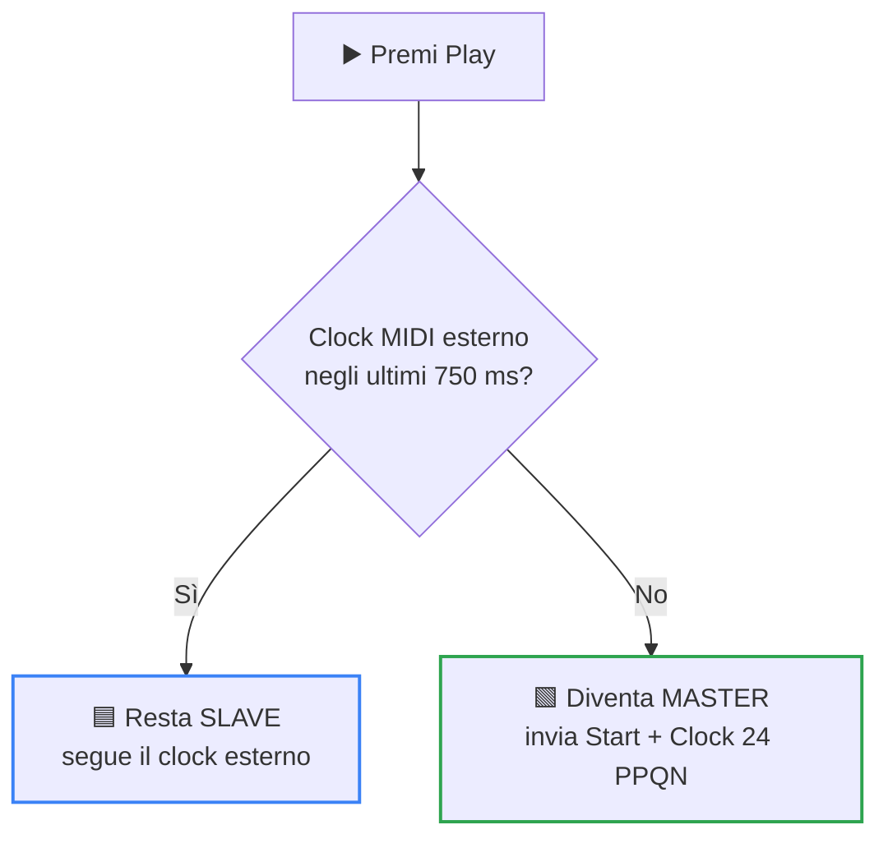
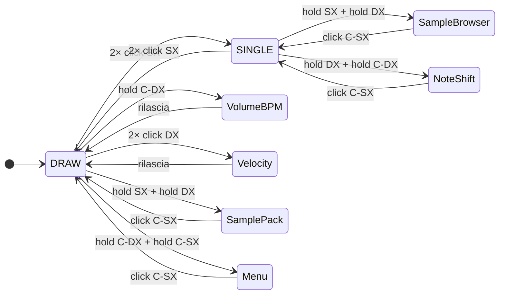

# 🎮 ichosynth — Manuale d'Uso

### Come suonare il campionatore-sequencer che si *disegna*

Disegni la musica su una griglia di LED 16×16 con 3–4 manopole. Niente computer, niente menù da memorizzare: giri, premi, ascolti.

> 🎧 **Non serve un computer per suonare**: il tuo **ichosynth** genera tutto da solo. Colleghi le
> cuffie, accendi via USB e via.

> 🆕 **Novità del fork ichosynth** *(tutte opzionali — col default si comporta come l'originale NI404)*:
> schermo **OLED** di stato · **MIDI clock OUT** (master sync) · build a **3 o 4 encoder**
> (`HAS_ENCODER4`) · configurazione centralizzata in [`config.h`](config.h).

---

## 📑 Indice

- [1 · Concetto in 30 secondi](#1--concetto-in-30-secondi)
- [2 · Le manopole (encoder)](#2--le-manopole-encoder)
- [3 · Leggere la griglia](#3--leggere-la-griglia)
- [4 · Modalità DRAW (disegno)](#4--modalità-draw-disegno)
- [5 · Pagine e pattern](#5--pagine-e-pattern)
- [6 · Mute (silenziare le voci)](#6--mute-silenziare-le-voci)
- [7 · Volume e BPM](#7--volume-e-bpm)
- [8 · Velocity](#8--velocity)
- [9 · Modalità SINGLE](#9--modalità-single-una-sola-voce)
- [10 · Cambiare campione (Sample Browser)](#10--cambiare-campione-sample-browser)
- [11 · Colori delle voci](#11--colori-delle-voci)
- [12 · Sample Pack](#12--sample-pack)
- [13 · Salvare e caricare](#13--salvare-e-caricare-le-tue-song)
- [14 · MIDI](#14--midi)
- [15 · Mappa modalità & comandi](#15--mappa-modalità--comandi)
- [16 · Problemi comuni](#16--problemi-comuni)

---

## 1 · Concetto in 30 secondi

La **griglia 16×16** è il tuo foglio musicale. Una "testina" di riproduzione scorre da sinistra a
destra: ogni colonna che tocca, suona le note che ci hai messo.

  

- Le **colonne** (sinistra→destra) sono i **16 step** di una battuta.
- Ogni **riga** è una **voce** (un campione o un synth), identificata da un **colore**.
- Più pagine in fila formano un **pattern/song**.

> 💡 Flusso base: **disegni note → premi Play → loop**. Cambi campioni, BPM e volume al volo, senza fermarti.

---

## 2 · Le manopole (encoder)

Ogni manopola si **gira** (muove cursore o regola valori) e si **preme** (azioni). Riconosce gesti
diversi: *click* singolo, *doppio click*, *hold* (pressione lunga) e *push* (tieni premuto).

  

| Manopola | Girando | Premendo (funzioni principali) |
|----------|---------|--------------------------------|
| **SINISTRA** (SX) | cursore **su/giù** (Y) | click = cancella nota · doppio click = modalità Single |
| **DESTRA** (DX) | cursore **sin/destra** (X) | click = muto voce · hold = muto tutto · doppio click = velocity |
| **CENTRALE-SX** (C-SX) | seleziona la **pagina** | push = disegna nota · hold = disegno continuo · (in Volume/BPM regola il BPM) |
| **CENTRALE-DX** (C-DX) | filtro / seek (4° encoder) | click = **Play/Pausa** · hold = **Volume/BPM** · (in Volume/BPM regola il Volume) |

> ℹ️ **Versione a 3 encoder**: niente centrale-destra; il volume si regola con la manopola sinistra.

Il **cursore** è il puntino bianco che pulsa: indica dove stai per agire.

---

## 3 · Leggere la griglia

- **Righe** = le voci (fino a 8 campioni + voci synth), ognuna con il suo **colore** (vedi [cap. 11](#11--colori-delle-voci)).
- **Colonne** = i 16 step della pagina corrente.
- **Riga in alto (status)**: a sinistra le **8 pagine** (indicatori), a destra le spie di stato (copia
  attiva, ecc.). Durante il Play gli indicatori pagina diventano **verdi**.
- **Testina di Play**: la colonna evidenziata che avanza mentre suoni (il ▼ nell'immagine sopra).

> 🆕 Se hai montato l'**OLED** del fork, lì leggi in chiaro: modalità, BPM, volume, velocity, pagina e
> stato Play/Stop.

---

## 4 · Modalità DRAW (disegno)

È la schermata principale, quella di default, dove crei i pattern.

| Azione | Gesto |
|---|---|
| 🧭 **Muovere il cursore** | gira **SX** (su/giù) e **DX** (sin/destra) |
| ✏️ **Aggiungere una nota** | **push C-SX** sul punto del cursore (senti subito il suono). Ripremendo su una nota, la voce **cambia** (cicla) |
| 🎨 **Disegno continuo** *(Etch-A-Sketch)* | **hold C-SX** per attivare il *paint mode*, poi muovi le manopole per disegnare una scia di note. Rilascia/clicca per smettere |
| 🧽 **Cancellare** | **click SX** = cancella la nota sotto il cursore · **hold SX** = cancellazione continua |
| ▶️ **Play / Pausa** | **click C-DX** |

---

## 5 · Pagine e pattern

- La griglia mostra **una pagina** (16 step) per volta.
- Gira **C-SX** per cambiare pagina (fino a **8 pagine → 128 step** per song).
- In Play, le pagine con note vengono suonate in sequenza in loop.

| Azione su pagina | Gesto |
|---|---|
| 📋 **Copia / incolla pagina** | **click SX + click DX** insieme: copia; ripeti su un'altra pagina per incollare |
| 🗑️ **Cancellare l'intera pagina** | **hold SX + hold C-SX** insieme |

---

## 6 · Mute (silenziare le voci)

- **Click DX**: muta/smuta la **voce corrente** (la riga su cui sei).
- **Hold DX**: muta **tutto** finché tieni premuto (rilascia per riattivare). Perfetto per stacchi/break dal vivo.

---

## 7 · Volume e BPM

- **Hold C-DX**: apre la schermata **Volume/BPM**.
- Dentro: **BPM** = gira **C-SX** (range ~40–240) · **Volume** = gira **C-DX** (o **SX** nella versione a 3 encoder).
- Per uscire: **rilascia** C-DX (torni a DRAW).

---

## 8 · Velocity

- **Doppio click DX**: apre la modalità velocity per la nota sotto il cursore.
- Regola con **C-SX**.
- Esci con il **rilascio**.

---

## 9 · Modalità SINGLE (una sola voce)

Utile per lavorare in dettaglio su un singolo campione (es. melodie su più altezze).

- **Entra**: **doppio click SX** sulla riga della voce da isolare.
- **Esci**: **doppio click SX** di nuovo.
- In SINGLE valgono gli stessi gesti di disegno/cancellazione di DRAW, ma agisci solo sulla voce selezionata.

### Spostare le note (Note Shift, in SINGLE)
- **Hold DX + hold C-DX**: entra in Note Shift.
- Muovi le note con le manopole.
- **Click C-SX** = conferma · **click SX** = annulla.

---

## 10 · Cambiare campione (Sample Browser)

Per assegnare un file WAV diverso a una voce:

1. Entra in **SINGLE** sulla voce desiderata ([cap. 9](#9--modalità-single-una-sola-voce)).
2. **Hold SX + hold DX**: apre il **browser dei campioni** (SET_WAV).
3. Naviga con la manopola: cambia **cartella** e **campione** (sfogli i file della SD); vedi l'anteprima della forma d'onda / lunghezza.
4. **Click SX** = carica il campione selezionato sulla voce.
5. **Click C-SX** = esci.

> 📁 I campioni vengono letti dalla SD nella struttura `/samples/<cartella>/_<numero>.wav`
> (vedi [manuale di costruzione, cap. 9](MANUALE_COSTRUZIONE.md#9--preparare-la-micro-sd-campioni)).

---

## 11 · Colori delle voci

Ogni voce ha un colore fisso (definito in [`colors.h`](colors.h)):

  

Le due voci **synth** (13 e 14) suonano onde generate internamente (*sawtooth* e *square*) e seguono
le altezze di una scala (Do3…Re5).

---

## 12 · Sample Pack (set di campioni)

Un "sample pack" è un set completo di voci salvato sulla SD: richiami al volo un intero kit.

- In DRAW: **hold SX + hold DX** apre la schermata **Sample Pack**.
- Seleziona il numero del pack con la manopola.
- **Click DX** = salva il set corrente in quel pack · **Click SX** = carica il pack · **Click C-SX** = esci.

> 📁 Sulla SD un pack è la cartella numerata `1`..`99` con dentro `1.wav`..`12.wav` (li gestisce
> ichosynth, non serve crearli a mano).

---

## 13 · Salvare e caricare le tue song

- In DRAW: **hold C-DX + hold C-SX** apre il **Menu**.
- **Click DX** = **salva** la song nello slot corrente · **Click SX** = **carica** · **Click C-SX** = esci.
- Le song si salvano sulla radice della SD come `<numero>.txt` (fino a 100).

> 💾 **Autosave/Autoload**: ichosynth salva automaticamente in `autosaved.txt` (es. quando metti in
> pausa) e ricarica quel contenuto all'accensione — ritrovi il lavoro dove l'avevi lasciato.

---

## 14 · MIDI

Tutto il MIDI passa dalla **porta USB** del Teensy (serve `USB Type = Serial + MIDI` in compilazione).

- **MIDI In (USB)**: ichosynth riceve note (le mappa sulla griglia/voce corrente) e si **sincronizza** a clock/start/stop MIDI esterni (slave).
- 🆕 **MIDI Clock Out (USB)** *(fork, se `MIDI_CLOCK_OUT_ENABLED = 1`)*: quando suoni, ichosynth invia **Clock (24 PPQN), Start e Stop**, così gli strumenti esterni si sincronizzano a ichosynth (master).

> ⚠️ Le prese DIN MIDI a 5 pin (pin 0/1) sono previste sul cablaggio ma il firmware attuale **non** le
> usa: il MIDI funziona solo via USB.

---

## 15 · Mappa modalità & comandi

Da DRAW (la schermata principale) raggiungi tutte le altre modalità con combinazioni di gesti:

Legenda: **SX** = sinistra · **DX** = destra · **C-SX** = centrale-sinistra · **C-DX** =
centrale-destra · "click" = pressione breve · "hold" = pressione lunga · "push" = tieni premuto.

| Vuoi… | Gesto |
|-------|-------|
| Muovere cursore su/giù | gira **SX** |
| Muovere cursore sin/destra | gira **DX** |
| Aggiungere una nota | **push C-SX** |
| Disegno continuo (Etch-A-Sketch) | **hold C-SX**, poi muovi |
| Cancellare una nota | **click SX** |
| Cancellazione continua | **hold SX**, poi muovi |
| Play / Pausa | **click C-DX** |
| Mute voce corrente | **click DX** |
| Mute tutto (momentaneo) | **hold DX** |
| Cambiare pagina | gira **C-SX** |
| Copia/incolla pagina | **click SX + click DX** |
| Cancellare la pagina | **hold SX + hold C-SX** |
| Volume / BPM | **hold C-DX** (BPM=C-SX, Vol=C-DX) |
| Velocity nota | **doppio click DX** |
| Entrare/uscire modalità Single | **doppio click SX** |
| Note Shift (in Single) | **hold DX + hold C-DX** |
| Sample browser (in Single) | **hold SX + hold DX** |
| Sample Pack (in Draw) | **hold SX + hold DX** |
| Menu salva/carica (in Draw) | **hold C-DX + hold C-SX** |

---

## 16 · Problemi comuni

| Sintomo | Rimedio |
|---|---|
| 🔇 **Non sento nulla** | controlla volume (hold C-DX), che la voce non sia in mute (click DX), e che il campione esista sulla SD nel formato giusto |
| ↩️ **Una manopola va al contrario** | è un'inversione CLK/DT in fase di cablaggio (vedi manuale di costruzione) |
| 🚫 **I campioni non partono** | percorso/struttura SD errati, o WAV non mono/16-bit/44,1 kHz → usa `wavmaker.py` |
| 💾 **Ho perso il lavoro** | c'è l'autosave (`autosaved.txt`), ma salva spesso anche manualmente in uno slot dal Menu |
| ⏱️ **Lunghezza massima campione** | ~30 secondi, con loop continuo |

---

Buon divertimento! 🎶

*ichosynth è un fork di **NI404** di SP_ (soundpauli) · firmware open-source MIT.*

*Questo firmware è dichiarato dall'autore "lontano dal completamento": alcune funzioni (filtri, alcune
scorciatoie) sono parziali. Puoi modificarlo e migliorarlo a piacere.*

