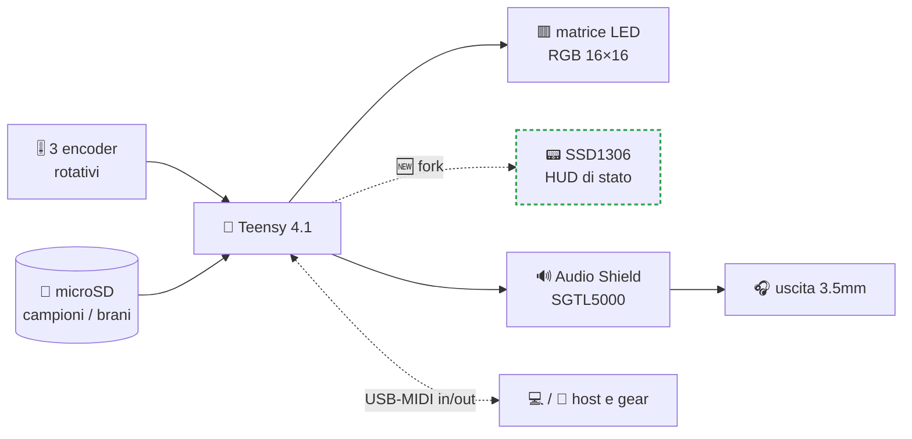
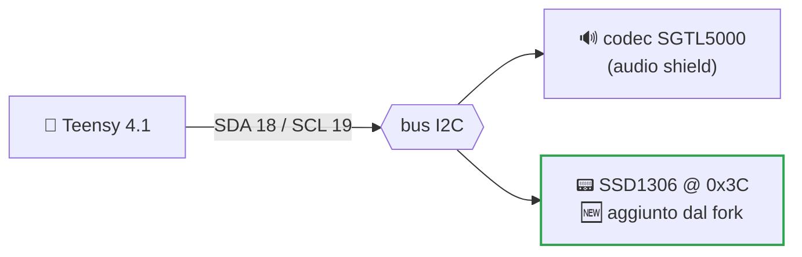
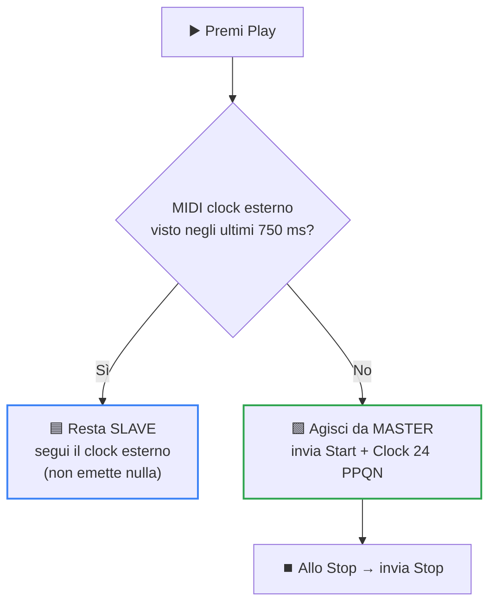

**🇮🇹 Italiano** · [🇬🇧 English](README.md)

<div align="center">

# 🎛️ ichosynth

### Un sampler-sequencer DIY e open-source che *disegni* come un Etch-A-Sketch™

Disegni la musica su una griglia di LED RGB 16×16 con **tre manopole rotative**. Niente computer, nessun menu su schermo da memorizzare — solo gira, premi e ascolta.

[](#-licenza)
[](https://www.pjrc.com/store/teensy41.html)
[](#-come-si-collega)
[](#-parte-del-progetto-ichos)
[](#-crediti--progetto-originale)
[](#-manuali--manuali-italiano)

</div>

> **Cos'è?** `ichosynth` è un **fork** amichevole di **[NI404](#-crediti--progetto-originale)** di **SP_ (soundpauli)**,
> cablato come **build a 4 encoder + 3 pulsanti**. Rispetto al progetto originale aggiunge un **OLED di stato** opzionale, la
> **sincronizzazione come master del MIDI clock**, una **configurazione hardware** in un unico file, il **filtro lowpass per-voce
> alla TŒRN** sul 4° encoder, la **registrazione** dal vivo (tieni REC), un **emulatore desktop** per provarlo senza hardware, e
> **manuali per principianti in inglese e italiano**. Le funzioni OLED, MIDI clock e registrazione sono configurabili in `config.h`.

---

## 🌍 Parte del progetto ICHOS

`ichosynth` è più di un fork — è lo strumento che i partecipanti **costruiscono con le proprie mani** durante
**[ICHOS 2026](https://www.francescogiannico.com/ichos-2026/)**, un workshop residenziale di *ecologia del suono*
a **Taranto, Italia** (12–14 giugno 2026), ideato e condotto dall'artista sonoro **Francesco Giannico**.

<p align="center">
  
</p>

> *ichos* — dall'antico greco **ἦχος**, *"suono"* — è descritto come un **"non-progetto"**: tre giorni
> di **ascolto**, field recording e trasformazione sonora nei luoghi *marginali* di Taranto — zone di
> confine escluse dalla cartolina, eppure dense di identità sonora e umana.

Il workshop scorre dall'**ascolto** → **field recording** → **costruzione dello strumento** → una **performance
elettroacustica collettiva**. I suoni catturati sul posto diventano la materia prima che questa piccola groovebox
riproduce: **registri un luogo, poi lo esegui come musica su uno strumento che hai saldato tu stesso.**

| Sito di field recording | Cos'è |
|---|---|
| **Circummarpiccolo** | un complesso di acquacoltura ittica del Novecento abbandonato |
| **Fiume Galeso** | strutture balneari in disuso tra il degrado ambientale |
| **Punta Pizzone** | un sito archeologico neolitico, stratificato di storia |

La costruzione del synth/sampler è guidata da **Luigi Massari** (che cura anche questo repository). L'esperienza
culmina in un **documentario sonoro** di **Roberta Trani**, in anteprima al **Vicoli Corti Festival**
(agosto 2026); ogni partecipante conserva lo strumento che ha costruito.

> 🔗 Tutti i dettagli e iscrizioni: **[francescogiannico.com/ichos-2026](https://www.francescogiannico.com/ichos-2026/)**

---

## ✨ Cosa aggiunge questo fork

| | NI404 originale | **Questo fork (`ichosynth`)** |
|---|:---:|:---:|
| Sampler-sequencer di base | ✅ | ✅ (invariato) |
| Mappa pin e flag delle funzioni | sparsi nello sketch | 🆕 **un solo file** → [`config.h`](config.h) |
| Display di stato | — | 🆕 **HUD OLED** (SSD1306 128×64) — *opzionale* |
| MIDI clock | solo slave | 🆕 **sync come master** (24 PPQN Start/Clock/Stop) — *opzionale* |
| 4 encoder + 3 pulsanti | 4° encoder parziale | 🆕 **PLAY/MENU/REC** su 3 pulsanti; il 4° encoder fa filtro/volume/seek |
| Filtro lowpass per voce | in catena ma non controllato | 🆕 **completato**, alla TŒRN: gira il **4° encoder** = cutoff della voce sotto il cursore (mutuato da TŒRN, MIT) |
| Registrazione dal vivo | — | 🆕 tieni **REC** → registra dall'ingresso del codec nel canale (`AudioInputI2S`+`AudioRecordQueue`) |
| Emulatore desktop | — | 🆕 esegue il firmware reale su PC/Mac (`emulator/`), con comandi touch a schermo |
| Documentazione | README in inglese | 🆕 **manuali italiani di costruzione + uso** (`.md` + `.pdf`) |

> 🎛️ **Questa è una build a 4 encoder + 3 pulsanti** (`HAS_ENCODER4 1`). Il 4° encoder è contestuale
> (filtro in DRAW/SINGLE, volume in VOLUME/BPM, seek nel browser); PLAY/MENU/REC stanno su tre tact switch.
> Imposta `HAS_ENCODER4 0` per la vecchia build a 3 encoder (gesti della 4ª manopola rimappati sui tre
> pulsanti degli encoder; nessun controllo filtro dal vivo).

<details>
<summary><b>📂 File modificati / aggiunti dal fork</b> (clicca per espandere)</summary>

```
ichosynth/
├── config.h                  🆕 tutti i pin + interruttori delle funzioni in un unico posto
├── display.h                 🆕 HUD di stato OLED SSD1306 (inattivo quando disabilitato)
├── soundpauli_ni404.ino      ✏️  config/display, hook MIDI-clock, remap gesti a 3 encoder
├── README.md                 ✏️  questo file
├── MANUALE_COSTRUZIONE.md    🆕 manuale italiano di costruzione DIY (cablato a mano, senza PCB)
├── MANUALE_USO.md            🆕 manuale italiano d'uso
├── MANUALE_*.pdf             🆕 versioni PDF di entrambi i manuali
├── colors.h / files.h / audioinit.h   (originale, invariato)
└── _DOCS/ , _SDCARD/         (file hardware originali, invariati)
```
</details>

---

## 📑 Indice

- [🌍 Parte del progetto ICHOS](#-parte-del-progetto-ichos)
- [🧠 L'idea in 30 secondi](#-lidea-in-30-secondi)
- [🔧 Come si collega](#-come-si-collega)
- [🔌 Funzione fork 1 — HUD di stato OLED](#-funzione-fork-1--hud-di-stato-oled)
- [🎹 Funzione fork 2 — MIDI clock OUT](#-funzione-fork-2--midi-clock-out-sync-come-master)
- [🔩 config.h a colpo d'occhio](#-configh-a-colpo-docchio)
- [🚀 Compilazione e flash](#-compilazione-e-flash)
- [📚 Manuali (Italiano)](#-manuali--manuali-italiano)
- [🧩 Elenco hardware](#-elenco-hardware)
- [🙏 Crediti e progetto originale](#-crediti--progetto-originale)
- [📄 Licenza](#-licenza)

---

## 🧠 L'idea in 30 secondi

Il pannello 16×16 è il tuo foglio di musica. Una testina di riproduzione scorre da sinistra a destra; ogni colonna che tocca suona
le note che hai disegnato lì. Ogni **riga è una voce** (un campione o un synth), ogni **colonna è uno step**.
Fino a **8 voci di campioni + le voci synth integrate** suonano insieme; concatena le pagine in un brano.



Disegna le note → premi Play → loop. Regola campioni, BPM, volume, velocity dal vivo, senza fermarti.
La guida completa per suonare è nel [manuale d'uso](MANUALE_USO.md).

---

## 🔧 Come si collega

I pin vivono in [`config.h`](config.h) — modifica la build per una variante hardware editando **un solo file**.

| Funzione | Pin Teensy | Macro |
|---|---|---|
| LED matrix DIN | `17` | `DATA_PIN` |
| Encoder **sinistro** (CLK / DT / btn) | `5` / `22` / `15` | `ENC_LEFT_*`, `BTN_LEFT` |
| Encoder **centrale** (CLK / DT / btn) | `9` / `14` / `16` | `ENC_MIDL_*`, `BTN_MIDL` |
| Encoder **destro** (CLK / DT / btn) | `4` / `2` / `3` | `ENC_RIGHT_*`, `BTN_RIGHT` |
| Encoder **4°** (CLK / DT / btn) | `32` / `33` / `41` | `ENC_MIDR_*`, `BTN_MIDR` |
| 🆕 **3 pulsanti** PLAY / MENU / REC | `24` / `25` / `26` | `BTN_SW1/2/3` |
| Bus I2C (codec **+ 🆕 OLED**) | `SDA 18` / `SCL 19` | `Wire` condiviso |

> 🎛️ Questa build usa **4 encoder** (`HAS_ENCODER4 1`) + **3 pulsanti** (PLAY/MENU/REC).
> Il **4° encoder è contestuale**: in DRAW/SINGLE regola il **filtro** (cutoff lowpass)
> della voce sotto il cursore — alla TŒRN, *gira e basta*, senza pulsante dedicato — e in
> VOLUME/BPM imposta il volume. Tieni **REC** per **registrare** un campione dall'ingresso
> del codec. (Per la vecchia build a 3 encoder: `HAS_ENCODER4 0`.)
> Il cablaggio completo passo-passo è nel [manuale di costruzione](MANUALE_COSTRUZIONE.md).

---

## 🔌 Funzione fork 1 — HUD di stato OLED

Un piccolo schermo **SSD1306 0.96" 128×64** che mostra **modalità · BPM · volume · velocity · pagina · play/stop**.
Condivide lo stesso bus I2C del codec audio (indirizzo diverso → nessun conflitto), quindi sono solo **4 fili**.



| Filo | OLED → Teensy |
|---|---|
| SDA | `→ 18` |
| SCL | `→ 19` |
| VCC | `→ 3V3` |
| GND | `→ GND` |

- **Abilitazione:** `#define OLED_ENABLED 1` in `config.h`.
- **Librerie extra (solo quando abilitato):** `Adafruit_SSD1306`, `Adafruit_GFX`.
- **Sicuro per il timing:** il refresh è limitato a `OLED_FPS` (15) e ridisegna solo quando un valore mostrato
  cambia (dirty-flag), così non disturba mai il loop audio. Indirizzo di default `0x3C` (alcuni pannelli `0x3D`).

---

## 🎹 Funzione fork 2 — MIDI clock OUT (sync come master)

Il sequencer può emettere i messaggi MIDI realtime **Clock (24 PPQN), Start e Stop** via USB-MIDI così il gear esterno
si sincronizza come slave su `ichosynth`. È un master gentile — genera il clock **solo** quando **non è presente alcun clock
esterno**, preservando il comportamento da clock-slave del progetto originale.



- **Abilitazione:** `#define MIDI_CLOCK_OUT_ENABLED 1` in `config.h`.
- Il transport riparte dall'inizio al play, quindi vengono inviati solo **Start/Stop** (nessun Continue).
- Tutto il MIDI (in *e* out) passa per la **porta USB del Teensy** — imposta `USB Type = Serial + MIDI` in compilazione.

---

## 🔩 config.h a colpo d'occhio

| Interruttore | Default | Significato |
|---|:---:|---|
| `OLED_ENABLED` | `0` | attiva/disattiva l'HUD OLED |
| `OLED_I2C_ADDR` | `0x3C` | indirizzo OLED (`0x3D` su alcuni pannelli) |
| `OLED_WIDTH` / `OLED_HEIGHT` | `128` / `64` | dimensione del pannello |
| `OLED_FPS` | `15` | refresh massimo del display (sicuro per l'audio) |
| `MIDI_CLOCK_OUT_ENABLED` | `0` | emette il MIDI clock come master |
| `EXTERNAL_CLOCK_TIMEOUT_MS` | `750` | finestra di rilevamento del clock esterno |
| `HAS_ENCODER4` | `1` | **questa build = 4 encoder**; il 4° fa filtro/volume/seek. `0` = vecchia build a 3 encoder |
| `BUTTONS3_ENABLED` | `1` | i 3 pulsanti PLAY/MENU/REC (pin 24/25/26) |
| `RECORD_ENABLED` | `1` | registrazione dal vivo (tieni REC): ingresso codec → campione sul canale |
| `BITCRUSH_ENABLED` | `1` | bitcrusher per-voce sulle 8 voci campione (1° effetto TŒRN; default bypass) |
| `LADDER_ENABLED` | `1` | filtro Moog ladder per-voce dopo il crusher (2° effetto TŒRN; default aperto) |
| `FXMODE_ENABLED` | auto | tieni MENU = FX MODE: le 4 manopole diventano slider (cutoff/ladder/risonanza/crush) |
| `FILTER_ENABLED` | `1` | lowpass per voce sul **4° encoder** (gira = cutoff); `0` = suono identico all'originale |

---

## 🚀 Compilazione e flash

> ⚡ **Setup in un colpo solo:** installa [`arduino-cli`](https://arduino.github.io/arduino-cli/) ed esegui lo
> script incluso — installa il core Teensy + ogni libreria (con le versioni giuste), applica la
> patch ResamplingReader e verifica la compilazione del firmware:
> - Windows: `powershell -ExecutionPolicy Bypass -File scripts\setup-dev-env.ps1`
> - macOS/Linux: `./scripts/setup-dev-env.sh`
>
> ⚠️ Due note sulle versioni di cui lo script si occupa per te: **FastLED deve essere la 3.9.10** (la 3.10.x si rompe sul
> percorso WS2812Serial del Teensy) e le due librerie **newdigate** (`teensy-variable-playback`,
> `teensy-polyphony`) devono provenire dalla HEAD di GitHub — le copie nel registry hanno versioni disallineate.

Preferisci farlo a mano nell'IDE?

1. Installa **Arduino IDE + [Teensyduino](https://www.pjrc.com/teensy/td_download.html)**.
2. Imposta **Tools → USB Type = `Serial + MIDI`** (variante 16×) e seleziona **Teensy 4.1**.
3. Installa le librerie: `WS2812Serial`, **Teensy Audio** (`Audio.h`), `Encoder` (Paul Stoffregen),
   `Mapf`, `FastLED`, `TeensyPolyphony` — più `Adafruit_SSD1306` + `Adafruit_GFX` *solo se* hai abilitato l'OLED.
4. ⚠️ Sostituisci `ResamplingReader.h` dentro `newdigate/teensy-variable-playback` con la copia in
   [`_DOCS/ResamplingReader.h`](_DOCS/ResamplingReader.h) — previene i crash da nullptr.
5. (Opzionale) edita [`config.h`](config.h) per abilitare l'OLED e/o il MIDI clock out.
6. Compila e carica. 🎉

> Servono 16 MB di PSRAM (2× chip) saldati al Teensy 4.1 — sono obbligatori per il firmware.

---

## 📚 Manuali — Manuali (Italiano)

Con questo fork sono inclusi due guide adatte ai principianti, in italiano:

| 📖 Manuale | Markdown | PDF |
|---|---|---|
| **Costruzione** (DIY cablato a mano, senza PCB custom) | [MANUALE_COSTRUZIONE.md](MANUALE_COSTRUZIONE.md) | [📄 PDF](MANUALE_COSTRUZIONE.pdf) |
| **Uso** (come suonare il synth) | [MANUALE_USO.md](MANUALE_USO.md) | [📄 PDF](MANUALE_USO.pdf) |

---

## 🧩 Elenco hardware

- PCB custom *(opzionale — puoi cablare tutto a mano; vedi il manuale di costruzione)*
- 1× **Teensy 4.1**
- 1× **Teensy Audio Adaptor** (TEENSY4_AUDIO)
- 2× chip **PSRAM** per Teensy 4.1 *(16 MB totali — richiesti)*
- 3× encoder rotativi **KY-040** (push + 360°) — sinistro, centrale, destro
- 1× **matrice LED RGB 16×16**
- 1× scheda **microSD** (Classe 10)
- *(opzione fork)* 1× OLED **SSD1306 0.96" 128×64 I2C**
- Cavi jumper, prolunga microSD *(opzionale)*, cuffie

> ℹ️ Niente altoparlanti o Bluetooth a bordo — usa le **cuffie**. Per ragioni di licenza, porta i tuoi
> WAV di campioni (mono / 16-bit / 44.1 kHz; `_SDCARD/wavmaker.py` li converte). La struttura delle cartelle
> è documentata nel manuale di costruzione.

---

## 🙏 Crediti e progetto originale

**ICHOS 2026** è ideato e condotto da **[Francesco Giannico](https://www.francescogiannico.com/ichos-2026/)**
(sound designer e musicista elettroacustico). La costruzione di `ichosynth` è guidata da **Luigi Massari**, con un
documentario sonoro di **Roberta Trani**.

Sul piano tecnico, questo strumento non esisterebbe senza **SP_ (alias soundpauli)**, creatore dell'
**NI404** originale, e **Paul Stoffregen / PJRC** per la piattaforma Teensy. Un ringraziamento speciale a **Nic
Newdigate** per la libreria `teensy-polyphony` — l'*anima* di questo strumento.

`ichosynth` è un fork rispettoso: tutto il codice originale, i file hardware e i crediti di design restano dell'
autore del progetto originale. Il fork si limita ad **aggiungere** funzioni opzionali e documentazione. Se il concept ti piace,
dai un'occhiata al progetto più avanzato di SP_, **TOERN** ([toern.live](https://toern.live)).

### Librerie utilizzate
`WS2812Serial` · Teensy Audio (`Audio.h` v1.0.6) · `Encoder` (Paul Stoffregen v1.4.4) ·
`Mapf` (v1.0.2, GPL-3.0) · `FastLED` (v3.9.10, MIT) · `TeensyPolyphony` (v1.0.7, MIT) ·
*(solo fork)* `Adafruit_SSD1306` · `Adafruit_GFX`

---

## 📄 Licenza

Rilasciato sotto **Licenza MIT** — libero per uso personale e commerciale, modifica e
distribuzione. Ogni libreria inclusa mantiene la propria licenza (vedi sopra); verifica di essere conforme a
tutte nella tua build.

<div align="center">

*Fatto con ❤️ a Taranto per il workshop **[ICHOS 2026](https://www.francescogiannico.com/ichos-2026/)** —
ascolta un luogo, poi riproducilo.*

*Un fork di NI404 di SP_ (Amburgo). Costruito da Luigi Massari · condotto da Francesco Giannico.*

</div>
