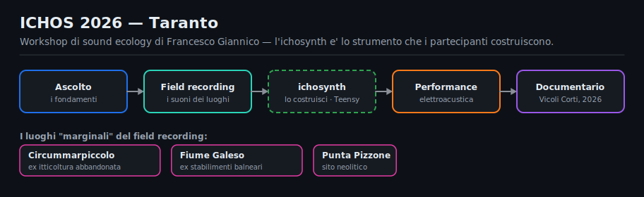
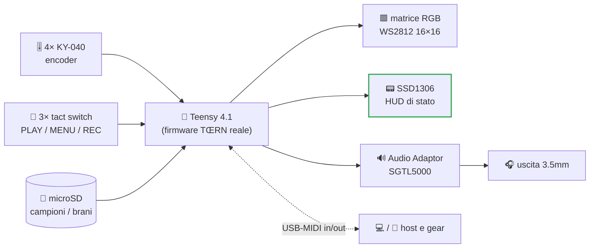
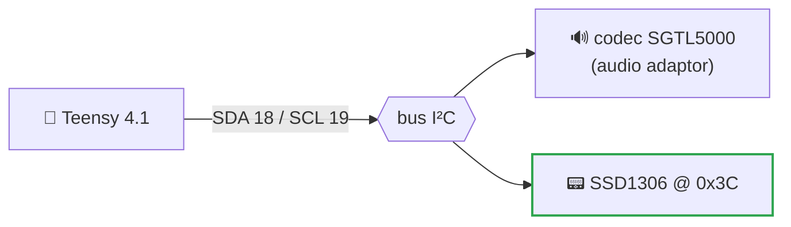

**🇮🇹 Italiano** · [🇬🇧 English](README.md)

<div align="center">

# 🎛️ ichosynth

### Una build di TŒRN saldata a mano e a basso costo, che suoni con le manopole e un piccolo schermo

ichosynth esegue il **firmware TŒRN reale e non modificato** ([TŒRN](https://toern.live)) su un Teensy 4.1
— un sampler-groovebox-sequencer completo — ma sostituisce le costose parti di input di TŒRN con altre
economiche e saldabili. Niente PCB custom, niente componenti speciali: solo cablaggio punto-punto a mano,
quattro manopole meccaniche, tre pulsanti e un piccolo OLED.

[](#-licenza)
[](https://www.pjrc.com/store/teensy41.html)
[](#-come-si-collega)
[](#-parte-del-progetto-ichos)
[](#-crediti--progetto-originale)
[](#-manuali--manuali-italiano)

</div>

> **Cos'è?** `ichosynth` è una **build di [TŒRN](https://toern.live) saldata a mano e a basso costo** —
> la groovebox di **SP_ (soundpauli)**. Esegue il *firmware TŒRN reale e non modificato* su un Teensy 4.1
> e sostituisce soltanto gli input costosi di TŒRN: i **4 encoder RGB I²C Duppa → 4× KY-040** meccanici,
> i **3 pad capacitivi → 3× tact switch** (PLAY / MENU / REC) e il **feedback degli anelli RGB degli
> encoder → 1× OLED SSD1306**. Poiché TŒRN è già uno strumento Teensy 4.1, **tutte le sue funzioni
> arrivano** — campioni, synth, effetti, song mode, registrazione dal vivo, MIDI. Un **emulatore
> desktop** incluso ti permette di provare lo stesso firmware su PC/Mac senza hardware.

---

## 🌍 Parte del progetto ICHOS

`ichosynth` è lo strumento che i partecipanti **costruiscono con le proprie mani** durante
**[ICHOS 2026](https://www.francescogiannico.com/ichos-2026/)**, un workshop residenziale di *ecologia del suono*
a **Taranto, Italia** (12–14 giugno 2026), ideato e condotto dall'artista sonoro **Francesco Giannico**.

<p align="center">
  
</p>

> *ichos* — dall'antico greco **ἦχος**, *"suono"* — è descritto come un **"non-progetto"**: tre giorni
> di **ascolto**, field recording e trasformazione sonora nei luoghi *marginali* di Taranto — zone di
> confine escluse dalla cartolina, eppure dense di identità sonora e umana.

Il workshop scorre dall'**ascolto** → **field recording** → **costruzione dello strumento** → una **performance
elettroacustica collettiva**. I suoni catturati sul posto diventano la materia prima che questa piccola groovebox
riproduce: **registri un luogo, poi lo esegui come musica su uno strumento che hai saldato tu stesso.**

| Sito di field recording | Cos'è |
|---|---|
| **Circummarpiccolo** | un complesso di acquacoltura ittica del Novecento abbandonato |
| **Fiume Galeso** | strutture balneari in disuso tra il degrado ambientale |
| **Punta Pizzone** | un sito archeologico neolitico, stratificato di storia |

La costruzione del synth/sampler è guidata da **Luigi Massari** (che cura anche questo repository). L'esperienza
culmina in un **documentario sonoro** di **Roberta Trani**, in anteprima al **Vicoli Corti Festival**
(agosto 2026); ogni partecipante conserva lo strumento che ha costruito.

> 🔗 Tutti i dettagli e iscrizioni: **[francescogiannico.com/ichos-2026](https://www.francescogiannico.com/ichos-2026/)**

---

## ✨ Cos'è ichosynth

ichosynth è **TŒRN, reso costruibile a mano**. Il firmware è quello di TŒRN, invariato; il lavoro del
progetto vive interamente nei **tre driver di input** che ricreano i controlli di TŒRN con componenti che
puoi saldare sul tavolo di cucina.

| Parte originale di TŒRN | **Sostituto economico e saldabile di ichosynth** | Driver |
|---|---|---|
| 4× encoder RGB I²C Duppa | 🔁 **4× KY-040** meccanici (gira + premi) | [`i2cEncoderLibV2`](teensy/libraries/i2cEncoderLibV2) — re-implementa l'API Duppa sulla libreria `Encoder` |
| 3× pad capacitivi | 🔁 **3× tact switch** (ruoli PLAY / MENU / REC) | [`FastTouch`](teensy/libraries/FastTouch) |
| Feedback anelli RGB degli encoder | 🔁 **1× OLED SSD1306 I²C** (canale / modalità / transport / BPM / volume / pagina) | [`IchosOled`](teensy/libraries/IchosOled) — minuscolo driver testuale FLASHMEM per SSD1306 |

Tutto il resto è puro TŒRN, e **funziona tutto su questo hardware**:

- **8 voci campione + 3 voci synth**, polifonia, DSP per-voce — filtro lowpass, **riverbero**, bitcrusher,
  detune, ottava e un **Moog ladder** sui synth.
- **Griglia sequencer RGB WS2812 16×16** (concatenabile a 32×16), pagine di pattern, subpattern, **song mode**.
- Per step: **velocity / probabilità / condizione**, mute, note-shift, copia-incolla.
- **Sample pack + browser SD**, seek / lunghezza / reverse, caricamento/salvataggio su SD.
- **Registrazione dal vivo** (tieni REC) con ingresso **MIC/LINE + count-in**.
- **USB MIDI**, impostazioni su EEPROM/SD, tap-tempo.

> 🔧 **Una funzione tagliata in questa build:** la seconda striscia LED reattiva opzionale (256 LED) è
> rimossa, il che libera il pin 24. Tutto il resto di TŒRN è presente.

<details>
<summary><b>📂 Cosa contiene questo repo</b> (clicca per espandere)</summary>

```
ichosynth/
├── teensy/
│   ├── build_toern.py         🛠️  clona TŒRN, applica il remap dei pin + i tagli alle funzioni,
│   │                              integra l'HUD OLED e compila → firmware/toern.hex
│   ├── libraries/
│   │   ├── i2cEncoderLibV2/   🔁 driver KY-040 (shim dell'API Duppa)  → ICHOS_ENC_PINS
│   │   ├── FastTouch/         🔁 driver tact-switch (shim del touch)  → ICHOS_BTN_PINS
│   │   └── IchosOled/         📟 minuscolo HUD testuale SSD1306
│   ├── firmware/toern.hex     ⚡ output di build flashabile
│   └── README.md              📘 il documento completo di build del port
├── emulator/                  🖥️  build desktop (target toernemu) — stesso firmware su PC/Mac
├── _FLASHER/                  🖱️  flasher GUI in un clic
├── _DOCS/
│   ├── MAPPA_CONTROLLI.md     🎛️ la mappa di riferimento dei controlli
│   └── FEATURE_INVENTORY.md   📋 il catalogo completo delle funzioni
└── assets/ , _SDCARD/         🖼️ grafiche + file di supporto per la SD
```
</details>

---

## 📑 Indice

- [🌍 Parte del progetto ICHOS](#-parte-del-progetto-ichos)
- [✨ Cos'è ichosynth](#-cosè-ichosynth)
- [🧠 L'idea in 30 secondi](#-lidea-in-30-secondi)
- [🔧 Come si collega](#-come-si-collega)
- [📟 L'HUD OLED](#-lhud-oled)
- [🚀 Compilazione e flash](#-compilazione-e-flash)
- [📚 Manuali (Italiano)](#-manuali--manuali-italiano)
- [🧩 Elenco hardware](#-elenco-hardware)
- [🙏 Crediti e progetto originale](#-crediti--progetto-originale)
- [📄 Licenza](#-licenza)

---

## 🧠 L'idea in 30 secondi

Il pannello 16×16 è il tuo foglio di musica. Una testina di riproduzione scorre da sinistra a destra; ogni colonna che tocca suona
le note che hai disegnato lì. Ogni **riga è una voce** (un campione o un synth), ogni **colonna è uno step**.
Fino a **8 voci campione + 3 voci synth** suonano insieme; concatena le pagine in pattern, e i pattern in un
intero **brano** (song).



Disegna le note → premi Play → loop. Regola campioni, effetti, BPM, volume e velocity dal vivo, senza fermarti.
La guida completa per suonare è nel [manuale d'uso](MANUALE_USO.md); la mappa dei controlli è in
[`_DOCS/MAPPA_CONTROLLI.md`](_DOCS/MAPPA_CONTROLLI.md).

---

## 🔧 Come si collega

ichosynth è **cablaggio punto-punto a mano — nessun PCB custom.** La mappa pin qui sotto è quella del port
TŒRN; la fonte autorevole sono i driver stessi (`ICHOS_ENC_PINS` in
[`i2cEncoderLibV2.h`](teensy/libraries/i2cEncoderLibV2), `ICHOS_BTN_PINS` in
[`FastTouch.h`](teensy/libraries/FastTouch)) più [`build_toern.py`](teensy/build_toern.py).

| Funzione | Pin Teensy (CLK / DT / SW) |
|---|---|
| Encoder **E1** (sinistro) | `5` / `22` / `15` |
| Encoder **E2** | `32` / `33` / `41` |
| Encoder **E3** | `9` / `14` / `16` |
| Encoder **E4** (destro) | `37` / `38` / `39` |
| Pulsanti **B1 / B2 / B3** (PLAY / MENU / REC) | `25` / `26` / `28` |
| LED matrix DIN | `17` |
| OLED + codec audio (I²C condiviso) | `SDA 18` / `SCL 19` |

> 🎛️ I quattro encoder KY-040 portano l'intero linguaggio di controllo di TŒRN (gira + premi, sensibile al
> contesto per ogni modalità); i tre tact switch assumono i ruoli PLAY / MENU / REC dei pad touch di TŒRN;
> tieni **REC** per **registrare** dall'ingresso del codec (MIC o LINE, con count-in). Il cablaggio
> completo passo-passo è nel [manuale di costruzione](MANUALE_COSTRUZIONE.md).

---

## 📟 L'HUD OLED

TŒRN mostra lo stato sugli anelli RGB dei suoi encoder Duppa. Le manopole KY-040 non hanno anelli, perciò
ichosynth porta quel feedback su un piccolo schermo **SSD1306 0.96" 128×64** — **canale · modalità ·
transport · BPM · volume · pagina**. Condivide lo stesso bus I²C del codec audio (indirizzo diverso →
nessun conflitto), quindi sono solo **4 fili**, pilotati dal driver testuale FLASHMEM incluso
[`IchosOled`](teensy/libraries/IchosOled).



| Filo | OLED → Teensy |
|---|---|
| SDA | `→ 18` |
| SCL | `→ 19` |
| VCC | `→ 3V3` |
| GND | `→ GND` |

L'HUD è integrato automaticamente dalla build; indirizzo I²C di default `0x3C` (alcuni pannelli `0x3D`).

---

## 🚀 Compilazione e flash

L'intero port è prodotto da un solo script:

```
python teensy/build_toern.py
```

Questo **clona i sorgenti di TŒRN** se mancano, applica il **remap dei pin + i tagli alle funzioni**,
**integra l'HUD OLED** e compila un **[`teensy/firmware/toern.hex`](teensy/firmware)** flashabile.
Servono [`arduino-cli`](https://arduino.github.io/arduino-cli/) e il core `teensy:avr`.

> ⚠️ **Perché `-O1`?** La build usa `-O1` (`opt=o1std`), perché il `-O2` di default fa crashare il gcc del
> Teensy sull'enorme unità di traduzione singola di TŒRN. Lo script lo imposta per te.

Tutti i dettagli — toolchain, versioni delle librerie e i passi esatti di remap/taglio — sono in
**[teensy/README.md](teensy/README.md)**.

> 🖱️ **Preferisci un clic?** In [`_FLASHER/`](_FLASHER) c'è un flasher GUI — l'esistente flasher di
> ichosynth — che carica il `.hex` compilato su un Teensy 4.1 senza riga di comando.

> 💾 Servono **16 MB di PSRAM (entrambi i chip) saldati** al Teensy 4.1 — sono **obbligatori** per il firmware.

---

## 📚 Manuali — Manuali (Italiano)

Con questo progetto sono incluse tre guide adatte ai principianti, ciascuna in **inglese** e **italiano**
(un selettore con le bandiere è in cima a ogni pagina). Sono incluse anche le versioni PDF.

| 📖 Manuale | 🇬🇧 English | 🇮🇹 Italiano |
|---|---|---|
| **Costruzione** — DIY cablato a mano, senza PCB custom | [BUILD_MANUAL.md](BUILD_MANUAL.md) · [PDF](BUILD_MANUAL.pdf) | [MANUALE_COSTRUZIONE.md](MANUALE_COSTRUZIONE.md) · [PDF](MANUALE_COSTRUZIONE.pdf) |
| **Uso** — come suonare il synth | [USAGE_MANUAL.md](USAGE_MANUAL.md) · [PDF](USAGE_MANUAL.pdf) | [MANUALE_USO.md](MANUALE_USO.md) · [PDF](MANUALE_USO.pdf) |
| **Ambiente di sviluppo** — setup Windows e macOS | [DEV_ENVIRONMENT.md](DEV_ENVIRONMENT.md) · [PDF](DEV_ENVIRONMENT.pdf) | [MANUALE_AMBIENTE.md](MANUALE_AMBIENTE.md) · [PDF](MANUALE_AMBIENTE.pdf) |

---

## 🧩 Elenco hardware

- 1× **Teensy 4.1** con **16 MB di PSRAM (entrambi i chip) saldati** *(obbligatorio)*
- 1× **Teensy Audio Adaptor** (SGTL5000; uscita cuffie, niente altoparlante)
- 1× **matrice RGB WS2812 16×16** *(concatenabile a 2 per una griglia 32×16)*
- 1× scheda **microSD** (Classe 10)
- 4× encoder rotativi **KY-040** (gira + premi) — E1…E4
- 3× **tact switch** (PLAY / MENU / REC)
- 1× OLED **SSD1306 0.96" 128×64 I²C**
- Cavi jumper, cuffie

> ℹ️ Niente altoparlanti o Bluetooth a bordo — usa le **cuffie**. Per ragioni di licenza, porta i tuoi
> WAV di campioni (mono / 16-bit / 44.1 kHz; `_SDCARD/wavmaker.py` li converte). La struttura delle cartelle
> è documentata nel manuale di costruzione.

---

## 🙏 Crediti e progetto originale

**ICHOS 2026** è ideato e condotto da **[Francesco Giannico](https://www.francescogiannico.com/ichos-2026/)**
(sound designer e musicista elettroacustico). La costruzione di `ichosynth` è guidata da **Luigi Massari**, con un
documentario sonoro di **Roberta Trani**.

Sul piano tecnico, ichosynth si regge interamente su **SP_ (alias soundpauli)**, autore di **entrambi**
**[TŒRN](https://toern.live)** — la groovebox il cui firmware questo strumento esegue — e dell'**NI404**
originale. Un enorme grazie anche a **Paul Stoffregen / PJRC** per la piattaforma Teensy e a **Nic
Newdigate** per `teensy-polyphony` / `teensy-variable-playback`, le librerie su cui poggiano le voci di TŒRN.

> 📜 **Una nota sulla storia:** questo repository è nato come fork dell'**NI404** di SP_. Quel firmware
> basato su NI404 è ancora qui, ma ora serve soltanto come **fallback / riferimento** — il prodotto è il
> **port di TŒRN** descritto sopra.

`ichosynth` è un port rispettoso e additivo: il firmware di TŒRN è usato **non modificato**, e tutto il
codice originale, i file hardware e i crediti di design restano di SP_. ichosynth si limita a **sostituire
l'hardware di input** e ad aggiungere l'HUD OLED e la documentazione.

### Librerie utilizzate
Firmware TŒRN (di SP_, MIT) · Teensy Audio (`Audio.h`) · `teensy-polyphony` / `teensy-variable-playback`
(Nic Newdigate) · `WS2812Serial` · i driver del port inclusi `i2cEncoderLibV2` · `FastTouch` · `IchosOled`

---

## 📄 Licenza

Rilasciato sotto **Licenza MIT** — libero per uso personale e commerciale, modifica e
distribuzione. Il firmware TŒRN e ogni libreria inclusa mantengono la propria licenza (vedi sopra); verifica
di essere conforme a tutte nella tua build.

<div align="center">

*Fatto con ❤️ a Taranto per il workshop **[ICHOS 2026](https://www.francescogiannico.com/ichos-2026/)** —
ascolta un luogo, poi riproducilo.*

*Una build di TŒRN saldata a mano e a basso costo, di SP_. Costruita da Luigi Massari · condotta da Francesco Giannico.*

</div>
