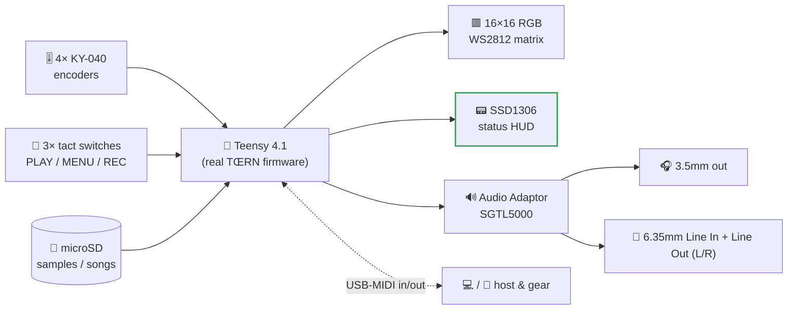
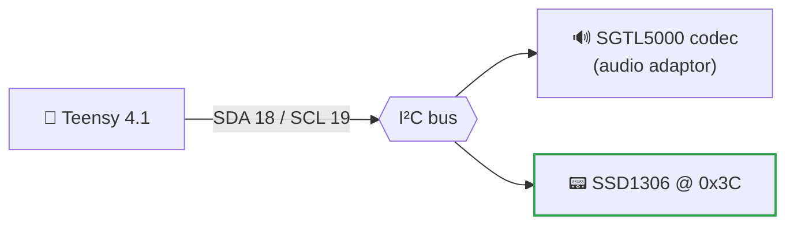

[🇮🇹 Italiano](README.it.md) · **🇬🇧 English**

<div align="center">

# 🎛️ ichosynth

### A hand-soldered, low-cost build of TŒRN you play with knobs and a tiny screen

ichosynth runs the **real, unmodified [TŒRN](https://toern.live) firmware** on a Teensy 4.1 — a full
sampler-groovebox-sequencer — but swaps TŒRN's expensive input parts for cheap, solderable ones. No
custom PCB, no fancy parts: just point-to-point hand wiring, four mechanical knobs, three buttons and a
little OLED.

[](#-license)
[](https://www.pjrc.com/store/teensy41.html)
[](#-how-its-wired)
[](#-part-of-the-ichos-project)
[](#-credits--upstream)
[](#-manuals--manuali-italiano)

</div>

> **What is this?** `ichosynth` is a **hand-soldered, low-cost build of [TŒRN](https://toern.live)** —
> the groovebox by **SP_ (soundpauli)**. It runs the *real, unmodified TŒRN firmware* on a Teensy 4.1
> and only replaces TŒRN's costly inputs: the **4 Duppa I²C RGB encoders → 4× KY-040** mechanical
> encoders, the **3 capacitive touch pads → 3× tact switches** (PLAY / MENU / REC), and the
> **encoder RGB-ring feedback → 1× SSD1306 OLED**. Because TŒRN is already a Teensy 4.1 instrument,
> **every TŒRN feature comes across** — samples, synths, effects, song mode, live recording, MIDI.
> A bundled **desktop emulator** lets you try the same firmware on PC/Mac without hardware.

---

## 🌍 Part of the ICHOS project

`ichosynth` is the instrument participants **build with their own hands** during
**[ICHOS 2026](https://www.francescogiannico.com/ichos-2026/)**, a residential *sound-ecology* workshop
in **Taranto, Italy** (12–14 June 2026), conceived and led by sound artist **Francesco Giannico**.

<p align="center">
  
</p>

> *ichos* — from the ancient Greek **ἦχος**, *"sound"* — is described as a **"non-project"**: three days
> of **listening**, field recording and sonic transformation in Taranto's *marginal* places — border
> zones left out of the postcard, yet dense with sonic and human identity.

The workshop flows from **listening** → **field recording** → **building the instrument** → a **collective
electroacoustic performance**. The sounds captured on site become the raw material this little groovebox
plays back: **you record a place, then perform it as music on an instrument you soldered yourself.**

| Field-recording site | What it is |
|---|---|
| **Circummarpiccolo** | an abandoned 20th-century fish-aquaculture complex |
| **Fiume Galeso** | derelict bathing facilities amid environmental decline |
| **Punta Pizzone** | a Neolithic archaeological site, layered with history |

The synth/sampler build is led by **Luigi Massari** (who also maintains this repository). The experience
culminates in a **sonic documentary** by **Roberta Trani**, premiering at the **Vicoli Corti Festival**
(August 2026); each participant keeps the instrument they built.

> 🔗 Full details & enrolment: **[francescogiannico.com/ichos-2026](https://www.francescogiannico.com/ichos-2026/)**

---

## ✨ What ichosynth is

ichosynth is **TŒRN, made buildable by hand**. The firmware is TŒRN's own, unchanged; the project's work
lives entirely in the **three input drivers** that re-create TŒRN's controls out of parts you can solder
on a kitchen table.

| TŒRN's original part | **ichosynth's cheap, solderable replacement** | Driver |
|---|---|---|
| 4× Duppa I²C RGB encoders | 🔁 **4× KY-040** mechanical encoders (turn + push) | [`i2cEncoderLibV2`](teensy/libraries/i2cEncoderLibV2) — re-implements the Duppa API on the `Encoder` library |
| 3× capacitive touch pads | 🔁 **3× tact switches** (PLAY / MENU / REC roles) | [`FastTouch`](teensy/libraries/FastTouch) |
| Encoder RGB-ring feedback | 🔁 **1× I²C SSD1306 OLED** (channel / mode / transport / BPM / volume / page) | [`IchosOled`](teensy/libraries/IchosOled) — a tiny FLASHMEM SSD1306 text driver |

Everything else is pure TŒRN, and **all of it works on this hardware**:

- **8 sample voices + 3 synth voices**, polyphony, per-voice DSP — lowpass filter, **reverb**, bitcrusher,
  detune, octave, and a **Moog ladder** on the synths.
- **16×16 RGB WS2812 sequencer grid** (chainable to 32×16), pattern pages, subpatterns, **song mode**.
- Per-step **velocity / probability / condition**, mute, note-shift, copy-paste.
- **Sample packs + SD browser**, seek / length / reverse, SD load/save.
- **Live recording** (hold REC) with **MIC/LINE input + count-in**.
- **Audio I/O on jacks**: a **6.35mm (1/4") mono Line In** to sample/record external gear, instruments
  or a field-recorder straight into the sampler, plus **2× 6.35mm mono Line Out (L + R)** to amp / mixer
  / PA / audio interface. The on-board **3.5mm stereo headphone jack stays for monitoring**.
- **USB MIDI**, EEPROM/SD settings, tap-tempo.

> 🔧 **One feature trimmed for this build:** the optional reactive 2nd LED strip (256 LEDs) is removed,
> which frees pin 24. Everything else in TŒRN is present.

<details>
<summary><b>📂 What lives in this repo</b> (click to expand)</summary>

```
ichosynth/
├── teensy/
│   ├── build_toern.py         🛠️  clones TŒRN, applies the pin remap + feature trims,
│   │                              wires in the OLED HUD, and compiles → firmware/toern.hex
│   ├── libraries/
│   │   ├── i2cEncoderLibV2/   🔁 KY-040 driver (Duppa-API shim)   → ICHOS_ENC_PINS
│   │   ├── FastTouch/         🔁 tact-switch driver (touch shim)  → ICHOS_BTN_PINS
│   │   └── IchosOled/         📟 tiny SSD1306 text HUD
│   ├── firmware/toern.hex     ⚡ flashable build output
│   └── README.md              📘 the full port build doc
├── emulator/                  🖥️  desktop build (target toernemu) — same firmware on PC/Mac
├── _FLASHER/                  🖱️  one-click GUI flasher
├── _DOCS/
│   ├── MAPPA_CONTROLLI.md     🎛️ the control-map reference
│   └── FEATURE_INVENTORY.md   📋 the full feature catalogue
└── assets/ , _SDCARD/         🖼️ artwork + SD-card helper files
```
</details>

---

## 📑 Table of contents

- [🌍 Part of the ICHOS project](#-part-of-the-ichos-project)
- [✨ What ichosynth is](#-what-ichosynth-is)
- [🧠 The idea in 30 seconds](#-the-idea-in-30-seconds)
- [🔧 How it's wired](#-how-its-wired)
- [📟 The OLED HUD](#-the-oled-hud)
- [🚀 Build & flash](#-build--flash)
- [📚 Manuals (Italiano)](#-manuals--manuali-italiano)
- [🧩 Hardware list](#-hardware-list)
- [🙏 Credits & upstream](#-credits--upstream)
- [📄 License](#-license)

---

## 🧠 The idea in 30 seconds

The 16×16 panel is your sheet of music. A play-head sweeps left→right; every column it touches plays
whatever notes you drew there. Each **row is a voice** (a sample or a synth), each **column a step**.
Up to **8 sample voices + 3 synth voices** play together; chain pages into patterns, and patterns into
a whole **song**.



<p align="center">
  
</p>

Draw notes → press Play → loop. Tweak samples, effects, BPM, volume and velocity live, without stopping.
The full playing guide is in the [usage manual](USAGE_MANUAL.md); the control map is in
[`_DOCS/MAPPA_CONTROLLI.md`](_DOCS/MAPPA_CONTROLLI.md).

---

## 🔧 How it's wired

ichosynth is **point-to-point hand wiring — no custom PCB.** The pin map below is the TŒRN port; the
authoritative source is the drivers themselves (`ICHOS_ENC_PINS` in
[`i2cEncoderLibV2.h`](teensy/libraries/i2cEncoderLibV2), `ICHOS_BTN_PINS` in
[`FastTouch.h`](teensy/libraries/FastTouch)) plus [`build_toern.py`](teensy/build_toern.py).

| Function | Teensy pin(s) (CLK / DT / SW) |
|---|---|
| **E1** encoder (left) | `5` / `22` / `15` |
| **E2** encoder | `32` / `33` / `41` |
| **E3** encoder | `9` / `14` / `16` |
| **E4** encoder (right) | `37` / `38` / `39` |
| **B1 / B2 / B3** buttons (PLAY / MENU / REC) | `25` / `26` / `28` |
| LED matrix DIN | `17` |
| OLED + audio codec (shared I²C) | `SDA 18` / `SCL 19` |

> 🎛️ The four KY-040 encoders carry TŒRN's full control language (turn + push, context-sensitive per
> mode); the three tact switches take the PLAY / MENU / REC roles of TŒRN's touch pads; hold **REC** to
> **record** from the codec input (MIC or LINE, with count-in). Full step-by-step wiring is in the
> [build manual](BUILD_MANUAL.md).

---

## 📟 The OLED HUD

TŒRN shows status on the RGB rings of its Duppa encoders. KY-040 knobs have no rings, so ichosynth puts
that feedback on a small **SSD1306 0.96" 128×64** screen — **channel · mode · transport · BPM · volume ·
page**. It shares the same I²C bus as the audio codec (different address → no conflict), so it's just
**4 wires**, driven by the bundled [`IchosOled`](teensy/libraries/IchosOled) FLASHMEM text driver.



| Wire | OLED → Teensy |
|---|---|
| SDA | `→ 18` |
| SCL | `→ 19` |
| VCC | `→ 3V3` |
| GND | `→ GND` |

The HUD is wired in automatically by the build; default I²C address `0x3C` (some panels `0x3D`).

---

## 🚀 Build & flash

The whole port is produced by one script:

```
python teensy/build_toern.py
```

It **clones the TŒRN sources** if they're missing, applies the **pin remap + feature trims**, **wires in
the OLED HUD**, and compiles a flashable **[`teensy/firmware/toern.hex`](teensy/firmware)**. It needs
[`arduino-cli`](https://arduino.github.io/arduino-cli/) and the `teensy:avr` core.

> ⚠️ **Why `-O1`?** The build uses `-O1` (`opt=o1std`), because the default `-O2` crashes the Teensy gcc
> on TŒRN's huge single translation unit. The script sets this for you.

Full details — toolchain, library versions, and the exact remap/trim steps — are in
**[teensy/README.md](teensy/README.md)**.

> 🖱️ **Prefer one click?** A GUI flasher lives in [`_FLASHER/`](_FLASHER) — the existing ichosynth
> flasher — which flashes the built `.hex` to a Teensy 4.1 without the command line.

> 💾 Needs **16 MB of PSRAM (both chips) soldered** to the Teensy 4.1 — it is **mandatory** for the firmware.

---

## 📚 Manuals — Manuali

Three beginner-friendly guides ship with this project, each in **English** and **Italian** (a flag
switcher sits at the top of every page). PDF versions are included too.

| 📖 Manual / Manuale | 🇬🇧 English | 🇮🇹 Italiano |
|---|---|---|
| **Build** — DIY hand-wired, no custom PCB | [BUILD_MANUAL.md](BUILD_MANUAL.md) · [PDF](BUILD_MANUAL.pdf) | [MANUALE_COSTRUZIONE.md](MANUALE_COSTRUZIONE.md) · [PDF](MANUALE_COSTRUZIONE.pdf) |
| **Usage** — how to play the synth | [USAGE_MANUAL.md](USAGE_MANUAL.md) · [PDF](USAGE_MANUAL.pdf) | [MANUALE_USO.md](MANUALE_USO.md) · [PDF](MANUALE_USO.pdf) |
| **Dev environment** — Windows & macOS setup | [DEV_ENVIRONMENT.md](DEV_ENVIRONMENT.md) · [PDF](DEV_ENVIRONMENT.pdf) | [MANUALE_AMBIENTE.md](MANUALE_AMBIENTE.md) · [PDF](MANUALE_AMBIENTE.pdf) |

---

## 🧩 Hardware list

- 1× **Teensy 4.1** with **16 MB PSRAM (both chips) soldered** *(mandatory)*
- 1× **Teensy Audio Adaptor** (SGTL5000; headphone out, no speaker)
- 1× **16×16 RGB WS2812 matrix** *(chainable to 2 for a 32×16 grid)*
- 1× **microSD** card (Class 10)
- 4× **KY-040** rotary encoders (turn + push) — E1…E4
- 3× **tact switches** (PLAY / MENU / REC)
- 1× **SSD1306 0.96" 128×64 I²C** OLED
- 3× **6.35mm (1/4") mono TS jacks** — 1× **Line In** (mono) + 2× **Line Out** (stereo: L + R), wired to
  the Audio Adaptor's LINE IN / LINE OUT pads
- Jumper wires, headphones

> ℹ️ No speakers or Bluetooth on board — use **headphones**. For licensing reasons, bring your own
> sample WAVs (mono / 16-bit / 44.1 kHz; `_SDCARD/wavmaker.py` converts them). The folder structure
> is documented in the build manual.

---

## 🙏 Credits & upstream

**ICHOS 2026** is conceived and led by **[Francesco Giannico](https://www.francescogiannico.com/ichos-2026/)**
(sound designer & electroacoustic musician). The `ichosynth` build is led by **Luigi Massari**, with a
sonic documentary by **Roberta Trani**.

On the technical side, ichosynth stands entirely on **SP_ (aka soundpauli)**, who authored **both**
**[TŒRN](https://toern.live)** — the groovebox whose firmware this instrument runs — and the original
**NI404**. Huge thanks also to **Paul Stoffregen / PJRC** for the Teensy platform, and to **Nic
Newdigate** for `teensy-polyphony` / `teensy-variable-playback`, the libraries TŒRN's voices rely on.

> 📜 **A note on history:** this repository began life as a fork of SP_'s **NI404**. That NI404-based
> firmware is still here, but it now serves only as a **fallback / reference** — the product is the
> **TŒRN port** described above.

`ichosynth` is a respectful, additive port: TŒRN's firmware is used **unmodified**, and all original code,
hardware files and design credit remain with SP_. ichosynth only **replaces the input hardware** and adds
the OLED HUD and documentation.

### Libraries used
TŒRN firmware (by SP_, MIT) · Teensy Audio (`Audio.h`) · `teensy-polyphony` / `teensy-variable-playback`
(Nic Newdigate) · `WS2812Serial` · the bundled port drivers `i2cEncoderLibV2` · `FastTouch` · `IchosOled`

---

## 📄 License

Released under the **MIT License** — free for personal and commercial use, modification, and
distribution. The TŒRN firmware and each bundled library keep their own license (see above); please
verify you comply with all of them in your build.

<div align="center">

*Made with ❤️ in Taranto for the **[ICHOS 2026](https://www.francescogiannico.com/ichos-2026/)** workshop —
listen to a place, then play it back.*

*A hand-soldered, low-cost build of TŒRN by SP_. Built by Luigi Massari · led by Francesco Giannico.*

</div>
