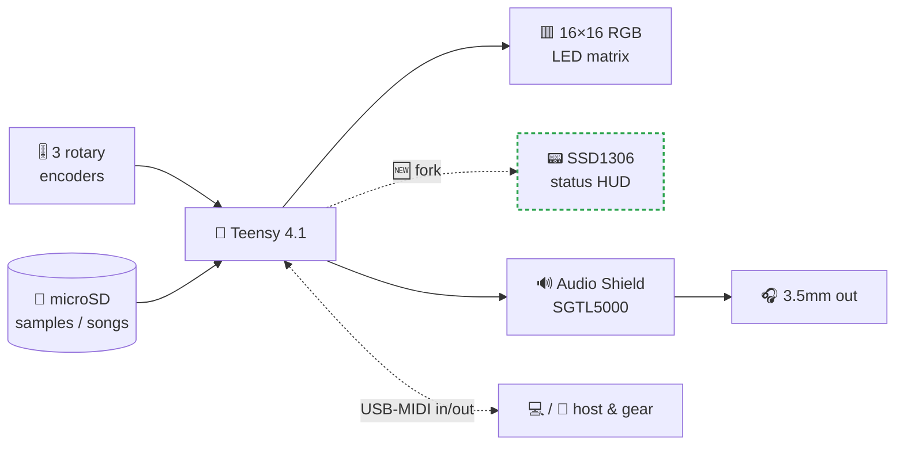
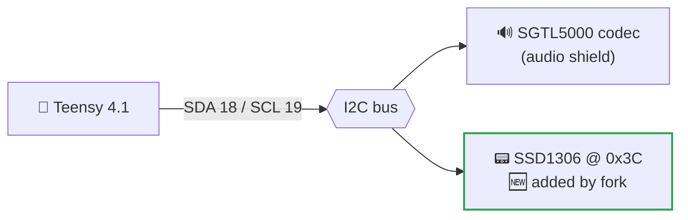
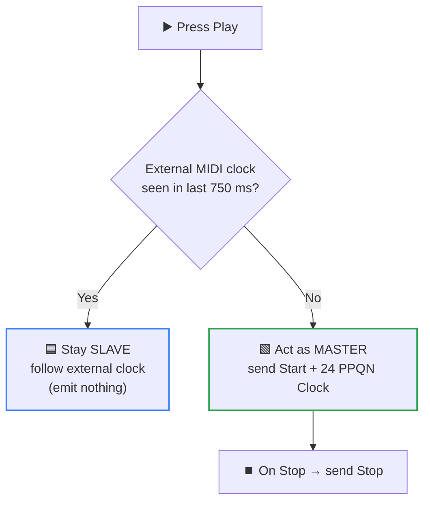

<div align="center">

# 🎛️ ichosynth

### A DIY, open-source sampler-sequencer you *draw* like an Etch-A-Sketch™

You sketch music onto a 16×16 RGB LED grid with **three rotary knobs**. No computer, no screen menus to memorize — just turn, push, and listen.

[](#-license)
[](https://www.pjrc.com/store/teensy41.html)
[](#-how-its-wired)
[](#-credits--upstream)
[](#-manuals--manuali-italiano)

</div>

> **What is this?** `ichosynth` is a friendly **fork of [NI404](#-credits--upstream)** by **SP_ (soundpauli)**,
> wired as a **3-encoder build**. On top of upstream it adds an optional **status OLED**, **MIDI clock
> master sync**, a single-file **hardware config**, a fully playable **3-encoder control scheme** (the
> 4th-knob gestures remapped onto the three buttons), and two **beginner-friendly Italian manuals**.
> The OLED and MIDI-clock features are **opt-in and default to OFF**.

---

## ✨ What this fork adds

| | Upstream NI404 | **This fork (`ichosynth`)** |
|---|:---:|:---:|
| Core sampler-sequencer | ✅ | ✅ (unchanged) |
| Pin map & feature flags | scattered in the sketch | 🆕 **one file** → [`config.h`](config.h) |
| Status display | — | 🆕 **OLED HUD** (SSD1306 128×64) — *opt-in* |
| MIDI clock | slave only | 🆕 **master sync** (24 PPQN Start/Clock/Stop) — *opt-in* |
| 3-encoder build | partial (rotation only) | 🆕 **fully playable**: Play/Pause, Volume/BPM, Menu & Note-Shift remapped to 3 buttons |
| Documentation | English README | 🆕 **Italian build + usage manuals** (`.md` + `.pdf`) |

> 🎛️ **This is a 3-encoder build** (`HAS_ENCODER4 0`). Upstream's 3-encoder mode only remapped the
> *rotation* (volume → left knob), leaving Play/Pause, Volume/BPM, Menu and Note-Shift on the missing
> 4th button. This fork remaps those gestures onto the three available buttons so the instrument is
> fully playable with three knobs. Set `HAS_ENCODER4 1` to restore the original 4-encoder layout.

<details>
<summary><b>📂 Files changed / added by the fork</b> (click to expand)</summary>

```
ichosynth/
├── config.h                  🆕 all pins + feature switches in one place
├── display.h                 🆕 SSD1306 OLED status HUD (no-op when disabled)
├── soundpauli_ni404.ino      ✏️  config/display, MIDI-clock hooks, 3-encoder gesture remap
├── README.md                 ✏️  this file
├── MANUALE_COSTRUZIONE.md    🆕 Italian DIY build manual (hand-wired, no PCB)
├── MANUALE_USO.md            🆕 Italian usage manual
├── MANUALE_*.pdf             🆕 PDF versions of both manuals
├── colors.h / files.h / audioinit.h   (upstream, unchanged)
└── _DOCS/ , _SDCARD/         (upstream hardware files, unchanged)
```
</details>

---

## 📑 Table of contents

- [🧠 The idea in 30 seconds](#-the-idea-in-30-seconds)
- [🔧 How it's wired](#-how-its-wired)
- [🔌 Fork feature 1 — OLED status HUD](#-fork-feature-1--oled-status-hud)
- [🎹 Fork feature 2 — MIDI clock OUT](#-fork-feature-2--midi-clock-out-master-sync)
- [🔩 config.h at a glance](#-configh-at-a-glance)
- [🚀 Build & flash](#-build--flash)
- [📚 Manuals (Italiano)](#-manuals--manuali-italiano)
- [🧩 Hardware list](#-hardware-list)
- [🙏 Credits & upstream](#-credits--upstream)
- [📄 License](#-license)

---

## 🧠 The idea in 30 seconds

The 16×16 panel is your sheet of music. A play-head sweeps left→right; every column it touches plays
whatever notes you drew there. Each **row is a voice** (a sample or a synth), each **column a step**.
Up to **8 sample voices + onboard synth voices** play together; chain pages into a song.



Draw notes → press Play → loop. Tweak samples, BPM, volume, velocity live, without stopping.
The full playing guide is in the [usage manual](MANUALE_USO.md).

---

## 🔧 How it's wired

Pins live in [`config.h`](config.h) — change the build for a hardware variant by editing **one file**.

| Function | Teensy pin(s) | Macro |
|---|---|---|
| LED matrix DIN | `17` | `DATA_PIN` |
| **Left** encoder (CLK / DT / btn) | `5` / `22` / `15` | `ENC_LEFT_*`, `BTN_LEFT` |
| **Center** encoder (CLK / DT / btn) | `9` / `14` / `16` | `ENC_MIDL_*`, `BTN_MIDL` |
| **Right** encoder (CLK / DT / btn) | `4` / `2` / `3` | `ENC_RIGHT_*`, `BTN_RIGHT` |
| I2C bus (codec **+ 🆕 OLED**) | `SDA 18` / `SCL 19` | shared `Wire` |
| ~~4th encoder~~ *(not fitted)* | `99` / `99` / `99` | `ENC_MIDR_*`, `BTN_MIDR` |

> 🎛️ This build uses **3 encoders** (`HAS_ENCODER4 0`): Left, Center, Right. Volume is on the **Left**
> knob, BPM on the **Center** knob. The 4th-encoder pins are set to `99` (unused). To build the full
> 4-encoder variant, set `HAS_ENCODER4 1` and restore the real `ENC_MIDR_*`/`BTN_MIDR` pins.
> Full step-by-step wiring is in the [build manual](MANUALE_COSTRUZIONE.md).

---

## 🔌 Fork feature 1 — OLED status HUD

A small **SSD1306 0.96" 128×64** screen showing **mode · BPM · volume · velocity · page · play/stop**.
It shares the same I2C bus as the audio codec (different address → no conflict), so it's just **4 wires**.



| Wire | OLED → Teensy |
|---|---|
| SDA | `→ 18` |
| SCL | `→ 19` |
| VCC | `→ 3V3` |
| GND | `→ GND` |

- **Enable:** `#define OLED_ENABLED 1` in `config.h`.
- **Extra libraries (only when enabled):** `Adafruit_SSD1306`, `Adafruit_GFX`.
- **Timing-safe:** refresh is throttled to `OLED_FPS` (15) and only redraws when a shown value
  changes (dirty-flag), so it never disturbs the audio loop. Default address `0x3C` (some panels `0x3D`).

---

## 🎹 Fork feature 2 — MIDI clock OUT (master sync)

The sequencer can emit MIDI realtime **Clock (24 PPQN), Start & Stop** over USB-MIDI so external gear
slaves to `ichosynth`. It is a polite master — it **only** generates clock when **no external clock is
present**, preserving upstream's clock-slave behavior.



- **Enable:** `#define MIDI_CLOCK_OUT_ENABLED 1` in `config.h`.
- The transport restarts from the top on play, so only **Start/Stop** are sent (no Continue).
- All MIDI (in *and* out) goes through the **Teensy USB port** — set `USB Type = Serial + MIDI` when compiling.

---

## 🔩 config.h at a glance

| Switch | Default | Meaning |
|---|:---:|---|
| `OLED_ENABLED` | `0` | turn the OLED HUD on/off |
| `OLED_I2C_ADDR` | `0x3C` | OLED address (`0x3D` on some panels) |
| `OLED_WIDTH` / `OLED_HEIGHT` | `128` / `64` | panel size |
| `OLED_FPS` | `15` | max display refresh (audio-safe) |
| `MIDI_CLOCK_OUT_ENABLED` | `0` | emit MIDI clock as master |
| `EXTERNAL_CLOCK_TIMEOUT_MS` | `750` | external-clock detection window |
| `HAS_ENCODER4` | `0` | **this build = 3 encoders**; `1` = original 4-encoder layout |

---

## 🚀 Build & flash

> ⚡ **One-shot setup:** install [`arduino-cli`](https://arduino.github.io/arduino-cli/) and run the
> bundled script — it installs the Teensy core + every library (with the right versions), applies the
> ResamplingReader patch, and compile-checks the firmware:
> - Windows: `powershell -ExecutionPolicy Bypass -File scripts\setup-dev-env.ps1`
> - macOS/Linux: `./scripts/setup-dev-env.sh`
>
> ⚠️ Two version notes the script handles for you: **FastLED must be 3.9.10** (3.10.x breaks on the
> Teensy WS2812Serial path), and the two **newdigate** libraries (`teensy-variable-playback`,
> `teensy-polyphony`) must come from GitHub HEAD — the registry copies are version-skewed.

Prefer to do it by hand in the IDE?

1. Install **Arduino IDE + [Teensyduino](https://www.pjrc.com/teensy/td_download.html)**.
2. Set **Tools → USB Type = `Serial + MIDI`** (16× variant) and select **Teensy 4.1**.
3. Install the libraries: `WS2812Serial`, **Teensy Audio** (`Audio.h`), `Encoder` (Paul Stoffregen),
   `Mapf`, `FastLED`, `TeensyPolyphony` — plus `Adafruit_SSD1306` + `Adafruit_GFX` *only if* you enabled the OLED.
4. ⚠️ Replace `ResamplingReader.h` inside `newdigate/teensy-variable-playback` with the copy in
   [`_DOCS/ResamplingReader.h`](_DOCS/ResamplingReader.h) — it prevents nullptr crashes.
5. (Optional) edit [`config.h`](config.h) to enable the OLED and/or MIDI clock out.
6. Compile & upload. 🎉

> Needs 16 MB of PSRAM (2× chips) soldered to the Teensy 4.1 — it's mandatory for the firmware.

---

## 📚 Manuals — Manuali (Italiano)

Two beginner-friendly guides ship with this fork, in Italian:

| 📖 Manuale | Markdown | PDF |
|---|---|---|
| **Costruzione** (DIY hand-wired, no custom PCB) | [MANUALE_COSTRUZIONE.md](MANUALE_COSTRUZIONE.md) | [📄 PDF](MANUALE_COSTRUZIONE.pdf) |
| **Uso** (how to play the synth) | [MANUALE_USO.md](MANUALE_USO.md) | [📄 PDF](MANUALE_USO.pdf) |

---

## 🧩 Hardware list

- Custom PCB *(optional — you can hand-wire everything; see the build manual)*
- 1× **Teensy 4.1**
- 1× **Teensy Audio Adaptor** (TEENSY4_AUDIO)
- 2× **PSRAM** chips for Teensy 4.1 *(16 MB total — required)*
- 3× **KY-040** rotary encoders (push + 360°) — Left, Center, Right
- 1× **16×16 RGB LED matrix**
- 1× **microSD** card (Class 10)
- *(fork option)* 1× **SSD1306 0.96" 128×64 I2C** OLED
- Jumper wires, microSD extension *(optional)*, headphones

> ℹ️ No speakers or Bluetooth on board — use **headphones**. For licensing reasons, bring your own
> sample WAVs (mono / 16-bit / 44.1 kHz; `_SDCARD/wavmaker.py` converts them). The folder structure
> is documented in the build manual.

---

## 🙏 Credits & upstream

This project would not exist without **SP_ (aka soundpauli)**, creator of the original **NI404**, and
**Paul Stoffregen / PJRC** for the Teensy platform. Special thanks to **Nic Newdigate** for the
`teensy-polyphony` library — the *soul* of this instrument.

`ichosynth` is a respectful fork: all original code, hardware files and design credit remain with the
upstream author. The fork only **adds** opt-in features and documentation. If you like the concept,
check out SP_'s more advanced project **TOERN** ([toern.live](https://toern.live)).

### Libraries used
`WS2812Serial` · Teensy Audio (`Audio.h` v1.0.6) · `Encoder` (Paul Stoffregen v1.4.4) ·
`Mapf` (v1.0.2, GPL-3.0) · `FastLED` (v3.9.10, MIT) · `TeensyPolyphony` (v1.0.7, MIT) ·
*(fork-only)* `Adafruit_SSD1306` · `Adafruit_GFX`

---

## 📄 License

Released under the **MIT License** — free for personal and commercial use, modification, and
distribution. Each bundled library keeps its own license (see above); please verify you comply with
all of them in your build.

<div align="center">

*Made with ❤️ for beginners and makers — fork of NI404 by SP_, Hamburg.*

</div>
