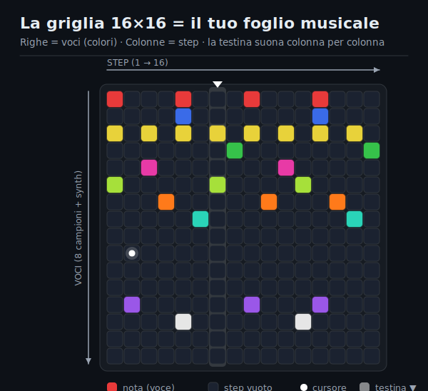
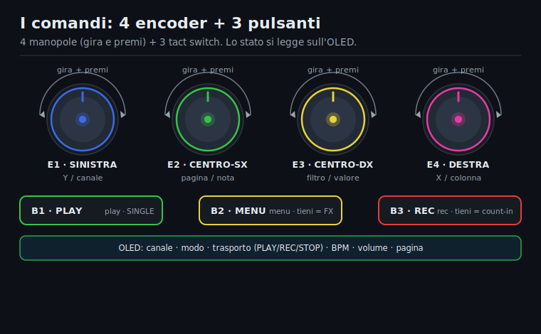
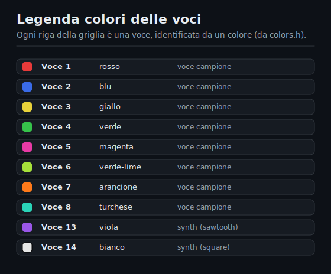
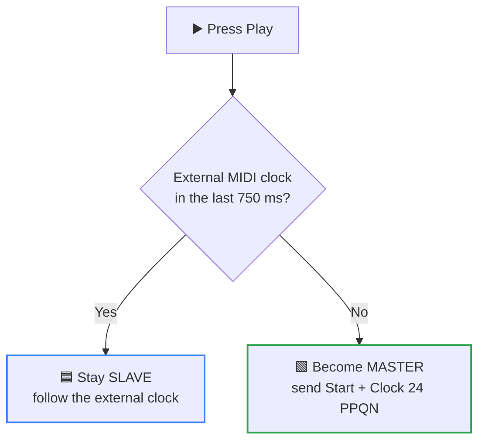
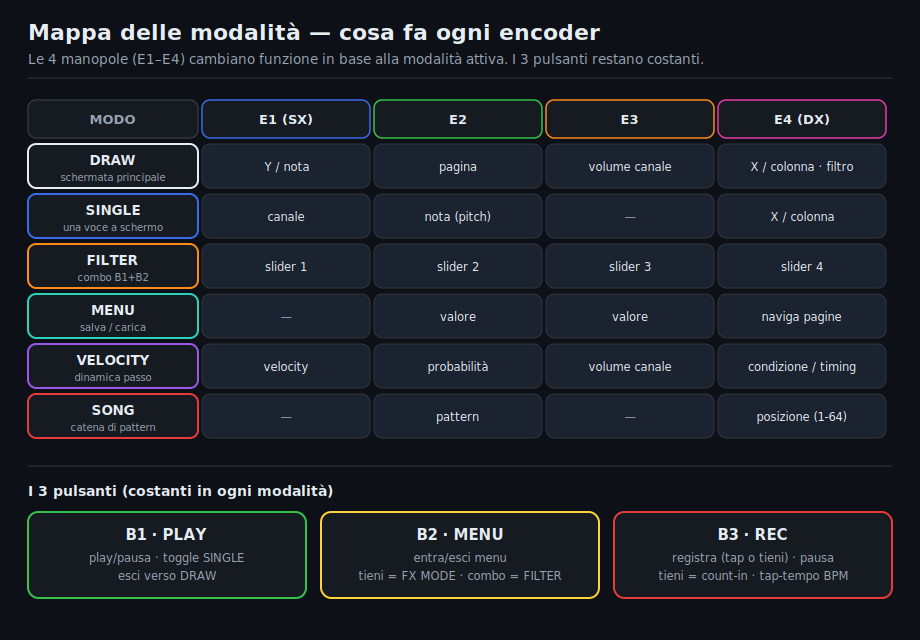

[🇮🇹 Italiano](MANUALE_USO.md) · **🇬🇧 English**

# 🎮 ichosynth — Usage Manual

### How to play the sampler-sequencer you *draw*

You draw music on a 16×16 LED grid with **3 knobs**. No computer, no menus to memorize: turn, press, listen.

> 🎧 **You don't need a computer to play**: your **ichosynth** generates everything on its own. Plug in
> your headphones, power it via USB, and off you go.

> 🆕 **This is the 3-encoder build.** Compared to the original 4-knob NI404, the **volume** is set
> with the **LEFT** knob, the **BPM** with the **CENTER** one, and the commands the original put on the
> 4th encoder (Play/Pause, Volume/BPM, Menu, Note-Shift) have been **remapped** onto the 3 available
> buttons. New in the fork: optional **OLED** screen and **MIDI clock OUT** (master sync).

---

## 📑 Table of Contents

- [1 · The concept in 30 seconds](#1--the-concept-in-30-seconds)
- [2 · The 3 knobs (encoders)](#2--the-3-knobs-encoders)
- [3 · Reading the grid](#3--reading-the-grid)
- [4 · DRAW mode (drawing)](#4--draw-mode-drawing)
- [5 · Pages and patterns](#5--pages-and-patterns)
- [6 · Mute (silencing voices)](#6--mute-silencing-voices)
- [7 · Volume and BPM](#7--volume-and-bpm)
- [8 · Velocity](#8--velocity)
- [9 · SINGLE mode](#9--single-mode-one-voice-only)
- [10 · Changing the sample (Sample Browser)](#10--changing-the-sample-sample-browser)
- [11 · Voice colors](#11--voice-colors)
- [12 · Sample Pack](#12--sample-pack-sample-set)
- [13 · Saving and loading](#13--saving-and-loading-your-songs)
- [14 · MIDI](#14--midi)
- [15 · Lowpass filter (fork)](#15--lowpass-filter-fork)
- [16 · Mode & command map](#16--mode--command-map)
- [17 · Common problems](#17--common-problems)

---

## 1 · The concept in 30 seconds

The **16×16 grid** is your music sheet. A playback "playhead" runs from left to right: every column it
touches plays the notes you've put there.

  

- The **columns** (left→right) are the **16 steps** of one bar.
- Each **row** is a **voice** (a sample or a synth), identified by a **color**.
- Several pages in a row make up a **pattern/song**.

> 💡 Basic flow: **draw notes → press Play → loop**. You change samples, BPM and volume on the fly, without stopping.

---

## 2 · The 3 knobs (encoders)

There are **3 knobs**: **LEFT (L)**, **CENTER (C)** and **RIGHT (R)**. Each one **turns** (moves the
cursor or adjusts values) and **presses**. It recognizes different gestures: single *click*, *double-click*,
*hold* (long press) and *push* (press and keep held).

  

| Knob | Turning | Pressing (main functions) |
|----------|---------|--------------------------------|
| **LEFT** (L) | cursor **up/down** (Y) · *in Volume/BPM: sets the **Volume*** | click = delete note · double-click = Single mode |
| **CENTER** (C) | selects the **page** · *in Volume/BPM: sets the **BPM*** | push = draw note · hold = continuous drawing · **double-click = Play/Pause** · click = back/exit |
| **RIGHT** (R) | cursor **left/right** (X) | click = mute voice · hold = mute all · double-click = velocity |

The **cursor** is the pulsing white dot: it shows where you're about to act.

> 💡 The **CENTER** knob is the "richest" one: turn it for the page, **press** (push) to draw,
> **hold** to draw continuously, **double-click** for Play/Pause, **single click** to go back from menus.

---

## 3 · Reading the grid

- **Rows** = the voices (up to 8 samples + synth voices), each with its own **color** (see [ch. 11](#11--voice-colors)).
- **Columns** = the 16 steps of the current page.
- **Top row (status)**: on the left the **8 pages** (indicators), on the right the status lights (copy
  active, etc.). During Play the page indicators turn **green**.
- **Play playhead**: the highlighted column that advances as you play (the ▼ in the image above).

> 🆕 If you've fitted the fork's **OLED**, there you can read in plain text: mode, BPM, volume, velocity, page and
> Play/Stop state.

---

## 4 · DRAW mode (drawing)

This is the main screen, the default one, where you create patterns.

| Action | Gesture |
|---|---|
| 🧭 **Move the cursor** | turn **L** (up/down) and **R** (left/right) |
| ✏️ **Add a note** | **push C** (center) on the cursor's spot (you hear the sound right away). Pressing again on a note **changes** the voice (cycles through them) |
| 🎨 **Continuous drawing** *(Etch-A-Sketch)* | **hold C** to enable *paint mode*, then move the knobs to draw a trail of notes. Release/click to stop |
| 🧽 **Delete** | **click L** = delete the note under the cursor · **hold L** = continuous deletion |
| ▶️ **Play / Pause** | **double-click C** (center) |

---

## 5 · Pages and patterns

- The grid shows **one page** (16 steps) at a time.
- Turn **C** to change page (up to **8 pages → 128 steps** per song).
- In Play, the pages with notes are played in sequence on a loop.

| Page action | Gesture |
|---|---|
| 📋 **Copy / paste page** | **click L + click R** together: copy; repeat on another page to paste |
| 🗑️ **Clear the whole page** | **hold L + hold C** together |

---

## 6 · Mute (silencing voices)

- **Click R**: mutes/unmutes the **current voice** (the row you're on).
- **Hold R**: mutes **everything** while you keep it held (release to reactivate). Perfect for live breaks/drops.

---

## 7 · Volume and BPM

- **Hold R + hold C** (together): opens the **Volume/BPM** screen.
- Inside: **Volume** = turn **L** · **BPM** = turn **C** (range ~40–240).
- To exit: **click C** (you return to DRAW).

> 💡 Reminder for the 3-encoder build: there's no 4th knob, so the volume has been "moved" onto the
> **LEFT** and the BPM onto the **CENTER**.

---

## 8 · Velocity

- **Double-click R**: opens velocity mode for the note under the cursor.
- Adjust with **C** (turn the center knob).
- Exit by **releasing**.

---

## 9 · SINGLE mode (one voice only)

Useful for working in detail on a single sample (e.g. melodies across several pitches).

- **Enter**: **double-click L** on the row of the voice you want to isolate.
- **Exit**: **double-click L** again.
- In SINGLE the same drawing/deletion gestures from DRAW apply, but you only act on the selected voice.

### Moving notes (Note Shift, in SINGLE)
- **Click R + hold C**: enters Note Shift.
- Move the notes with the knobs.
- **Click C** = confirm · **click L** = cancel.

---

## 10 · Changing the sample (Sample Browser)

To assign a different WAV file to a voice:

1. Enter **SINGLE** on the desired voice ([ch. 9](#9--single-mode-one-voice-only)).
2. **Hold L + hold R**: opens the **sample browser** (SET_WAV).
3. Navigate with the knob: change **folder** and **sample** (browse the SD's files); see the waveform / length preview.
4. **Click L** = loads the selected sample onto the voice.
5. **Click C** = exit.

> 📁 The samples are read from the SD in the structure `/samples/<folder>/_<number>.wav`
> (see [build manual, ch. 9](BUILD_MANUAL.md)).

---

## 11 · Voice colors

Each voice has a fixed color (defined in [`colors.h`](colors.h)):

  

The two **synth** voices (13 and 14) play internally generated waves (*sawtooth* and *square*) and follow
the pitches of a scale (C3…D5).

---

## 12 · Sample Pack (sample set)

A "sample pack" is a complete set of voices saved on the SD: you recall a whole kit on the fly.

- In DRAW: **hold L + hold R** opens the **Sample Pack** screen.
- Select the pack number with the knob.
- **Click R** = saves the current set into that pack · **Click L** = loads the pack · **Click C** = exit.

> 📁 On the SD a pack is the numbered folder `1`..`99` containing `1.wav`..`12.wav` (ichosynth manages
> them, you don't need to create them by hand).

---

## 13 · Saving and loading your songs

- In DRAW: **click L + hold C** opens the **Menu**.
- **Click R** = **saves** the song into the current slot · **Click L** = **loads** · **Click C** = exit.
- Songs are saved to the SD's root as `<number>.txt` (up to 100).

> 💾 **Autosave/Autoload**: ichosynth saves automatically to `autosaved.txt` (e.g. when you pause) and
> reloads that content at power-on — you find your work right where you left it.

---

## 14 · MIDI

All MIDI goes through the Teensy's **USB port** (you need `USB Type = Serial + MIDI` at compile time).

- **MIDI In (USB)**: ichosynth receives notes (mapping them onto the grid/current voice) and **syncs** to
  external MIDI clock/start/stop (slave).
- 🆕 **MIDI Clock Out (USB)** *(fork, if `MIDI_CLOCK_OUT_ENABLED = 1`)*: when you play, ichosynth sends
  **Clock (24 PPQN), Start and Stop**, so external instruments sync to ichosynth (master).

> ⚠️ The 5-pin DIN MIDI jacks (pins 0/1) are provided in the wiring but the current firmware does **not**
> use them: MIDI works only over USB.

---

## 15 · Lowpass filter (fork)

🆕 *Fork feature* (if `FILTER_ENABLED = 1`, on by default). Adds a **per-voice lowpass filter**: each
voice gets its own cutoff that softens or "closes" the sound (rolls off the highs).

> 🎛️ It needs one extra **momentary pushbutton** (see the build manual): a plain button between **pin
> 41** and **GND**. It's not an encoder, just a button — the 3-knob hardware stays as it is.

**How to use it:**
1. Move the cursor onto the **voice** you want to filter (the row, just like for mute).
2. **Hold the FILTER button** and **turn the CENTER knob**:
   - clockwise = filter **open** (bright sound, up to 9 kHz);
   - counter-clockwise = filter **closed** (dark/muffled, down to ~280 Hz).
3. A **light bar** across the middle of the grid shows the cutoff, in the voice's color. **Release** to exit.

The value is **per voice** and is **saved with the song** (it comes back identical on reload).

> 💡 At power-on the filters start **open** (9 kHz): the dry sound is brighter than the original NI404
> (which left the filters at a ~1 kHz default, slightly muffled). For behavior identical to the
> original, set `FILTER_ENABLED 0` in `config.h` (and skip the button).

---

## 16 · Mode & command map

From DRAW (the main screen) you reach all the other modes with combinations of gestures:

  

Legend: **L** = left · **C** = center · **R** = right · "click" = short press · "hold" = long press ·
"push" = press and keep held · "2× click" = double-click.

| You want to… | Gesture |
|-------|-------|
| Move cursor up/down | turn **L** |
| Move cursor left/right | turn **R** |
| Add a note | **push C** |
| Continuous drawing (Etch-A-Sketch) | **hold C**, then move |
| Delete a note | **click L** |
| Continuous deletion | **hold L**, then move |
| **Play / Pause** | **double-click C** |
| Mute current voice | **click R** |
| Mute all (momentary) | **hold R** |
| Change page | turn **C** |
| Copy/paste page | **click L + click R** |
| Clear the page | **hold L + hold C** |
| Volume / BPM (enter) | **hold R + hold C** → Vol = turn **L**, BPM = turn **C** |
| Volume / BPM (exit) | **click C** |
| Note velocity | **double-click R** (adjust with **C**) |
| 🆕 Lowpass filter (current voice) | **hold the FILTER button + turn C** |
| Enter/exit Single mode | **double-click L** |
| Note Shift (in Single) | **click R + hold C** |
| Sample browser (in Single) | **hold L + hold R** |
| Sample Pack (in Draw) | **hold L + hold R** |
| Save/load menu (in Draw) | **click L + hold C** |

> ⚠️ **Watch out for two similar gestures**: *Clear page* = **hold** L + hold C; *Save/load menu*
> = **click** L + hold C. Only L changes (keep held vs tap).

---

## 17 · Common problems

| Symptom | Fix |
|---|---|
| 🔇 **I don't hear anything** | check the volume (hold R + hold C, then turn L), that the voice isn't muted (click R), and that the sample exists on the SD in the right format |
| ▶️ **It won't start / won't go to Play** | Play is a **double-click** on the CENTER (two quick taps), not a single click |
| ↩️ **A knob goes the wrong way** | it's a CLK/DT swap from the wiring stage (see the build manual) |
| 🚫 **The samples won't play** | wrong SD path/structure, or WAV not mono/16-bit/44.1 kHz → use `wavmaker.py` |
| 💾 **I lost my work** | there's the autosave (`autosaved.txt`), but also save often manually into a slot from the Menu |
| ⏱️ **Maximum sample length** | ~30 seconds, with continuous looping |

---

Have fun! 🎶

*ichosynth is a fork (3-encoder build) of **NI404** by SP_ (soundpauli) · open-source MIT firmware.*

*This firmware is declared by the author "far from complete": some functions (filters, a few shortcuts)
are partial. You're free to modify and improve it as you like.*

